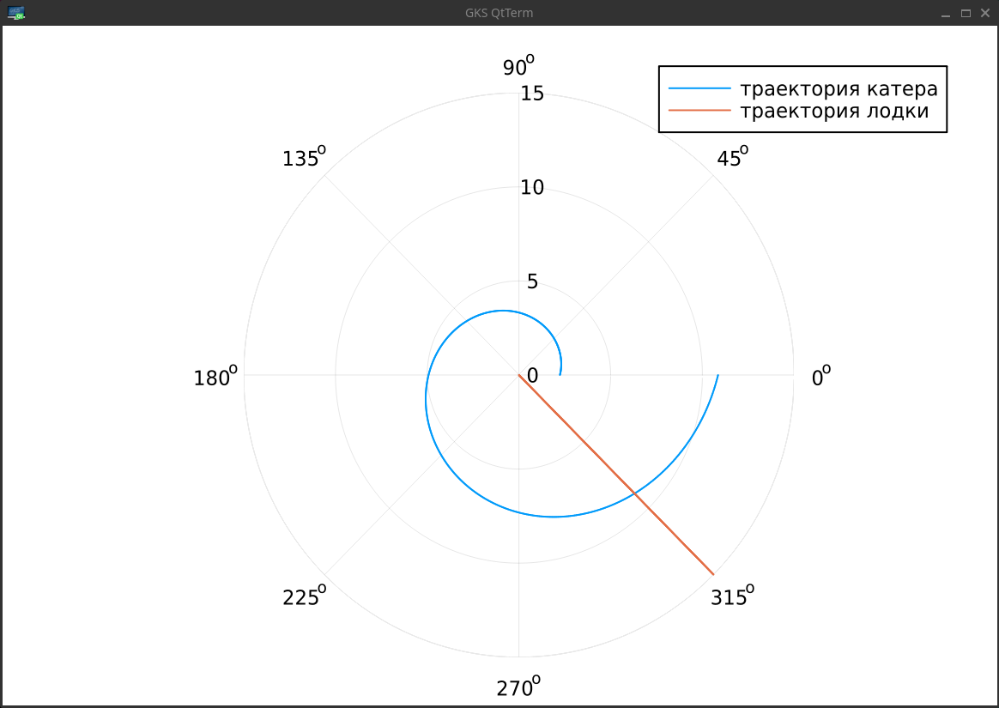
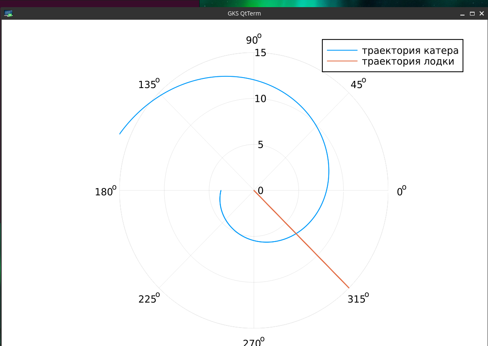

---
## Front matter
lang: ru-RU
title: Презентация по лабораторной работе №2
subtitle: ""
author:
  - Амуничников Антон
institute:
  - Российский университет дружбы народов, Москва, Россия

## i18n babel
babel-lang: russian
babel-otherlangs: english

## Formatting pdf
toc: false
toc-title: Содержание
slide_level: 2
aspectratio: 169
section-titles: true
theme: metropolis
header-includes:
 - \metroset{progressbar=frametitle,sectionpage=progressbar,numbering=fraction}
 - '\makeatletter'
 - '\beamer@ignorenonframefalse'
 - '\makeatother'
---


## Докладчик

  * Амуничников Антон Игоревич
  * 1132227133
  * уч. группа: НПИбд-01-22
  * Факультет физико-математических и естественных наук
  * Российский университет дружбы народов

## Цели и задачи

Построить математическую модель для выбора правильной стратегии при
решении примера задачи поиска.

##  Определение варианта

{#fig:1 width=70%}

# Вывод уравнения

## Выполнение лабораторной работы

$t_0 = 0$, $x_0 = 0$ -- место нахождения лодки браконьеров в момент обнаружения,$x_{k0} = k$ - место нахождения катера береговой охраны относительно лодки браконьеров в момент обнаружения лодки

Введем полярные координаты. Считаем, что полюс - это точка обнаружения лодки браконьеров $x_{k0}$ ($\theta = x_{k0} = 0$), а полярная ось $r$ проходит через точку нахождения катера береговой охраны.

## Выполнение лабораторной работы

Чтобы найти расстояние $x$ (расстояние, после которого катер начнет двигаться вокруг полюса), необходимо составить простое уравнение:

$$
\dfrac{x}{v} = \dfrac{k-x}{4.1v} \text{ -- в первом случае}
$$
$$
\dfrac{x}{v} = \dfrac{k+x}{4.1v} \text{ -- во втором случае}
$$

Найдем $x_1 = \dfrac{11.4}{5,1}$ и $x_2 = \dfrac{11.4}{3,1}$, задачу будем решать для двух случаев.

## Выполнение лабораторной работы

Тангенциальная скорость – это линейная скорость вращения катера относительно полюса. Она равна произведению угловой скорости $\dfrac{d \theta}{dt}$ на радиус $r$, $r \dfrac{d \theta}{dt}$.

Получаем: 

$$v_{\tau} = \sqrt{16.81v^2-v^2} = \sqrt{15.81}v$$

Из чего можно вывести:

$$
r\dfrac{d \theta}{dt} = \sqrt{15.81}v
$$

## Выполнение лабораторной работы

Решение исходной задачи сводится к решению системы из двух дифференциальных уравнений:

$$\begin{cases}
&\dfrac{dr}{dt} = v\\
&r\dfrac{d \theta}{dt} = \sqrt{15.81}v
\end{cases}$$

## Выполнение лабораторной работы

С начальными условиями для первого случая:

$$\begin{cases}
&{\theta}_0 = 0\\  \tag{1}
&r_0 = \dfrac{11.4}{5.1}
\end{cases}$$

## Выполнение лабораторной работы

Или для второго:

$$\begin{cases}
&{\theta}_0 = -\pi\\  \tag{2}
&r_0 = \dfrac{11.4}{3.1}
\end{cases}$$

## Выполнение лабораторной работы

Исключая из полученной системы производную по $t$, можно перейти к следующему уравнению:

$$
\dfrac{dr}{d \theta} = \dfrac{r}{\sqrt{15.81}}
$$


# Построение модели

## Выполнение лабораторной работы

```Julia
k = 11.4 // расстояние  от лодки до катера

// данные для лодки браконьеров
fi = 3*pi/4 
t = 0:0.01:15
fl(t) = tan(fi)*t //функция, описывающая движение лодки браконьеров

f(u, p, t) = u/sqrt(15.81) // функция, описывающая движение катера береговой охраны
```

## Выполнение лабораторной работы

```Julia
// начальные условия для двух случаев
x1 = k/5.1 
x2 = k/3.1

tetha1 = (0.0, 2*pi)
tetha2 = (-pi, pi)

```

## Выполнение лабораторной работы

```Julia
 
s1 = ODEProblem(f, x1, tetha1)

sol1 = solve(s1, Tsit5(), saveat=0.01)

```

```Julia
plot(sol1.t, sol1.u, proj=:polar, lims=(0,15), label="траектория катера")

plot!(fill(fi, length(t)), fl.(t), label="траектория лодки")

```
## Выполнение лабораторной работы

{#fig:2 width=70%}


## Выполнение лабораторной работы

```Julia

s2 = ODEProblem(f, x2, tetha2)

sol2 = solve(s2, Tsit5(), saveat=0.01)

```

```Julia
plot(sol2.t, sol2.u, proj=:polar, lims=(0,15), label="траектория катера")

plot!(fill(fi, length(t)), fl.(t), label="траектория лодки")

```
## Выполнение лабораторной работы

{#fig:3 width=70%}

# Вывод точки пересечения

## Выполнение лабораторной работы

Решив задачу Коши, получим для первого случая

$$
r=\dfrac{38\,{e}^{\frac{10\,x}{\sqrt{1581}}}}{17}
$$

## Выполнение лабораторной работы

и для второго случая

$$
r=\dfrac{114\,{e}^{\frac{10\,x}{\sqrt{1581}}+\frac{10\,\pi}{\sqrt{1581}}}}{31}
$$

## Выполнение лабораторной работы

```Julia
y(x)=(38*exp(10*x)/(sqrt(1581)))/(17)
y(fi)
// точка пересечения лодки и катера для 1 случая
9.609292077117887e8
```

## Выполнение лабораторной работы

```Julia

y2(x)=(114*exp((10*x/sqrt(1581))+(10*pi/sqrt(1581))))/(31)
y2(fi-pi)
// точка пересечения лодки и катера для 2 случая
6.651143558300665

```

## Выводы

Изучена задача погони. Была построена математическая модель для выбора правильной стратегии при
решении примера задачи поиска.


