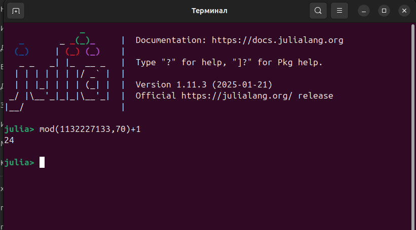
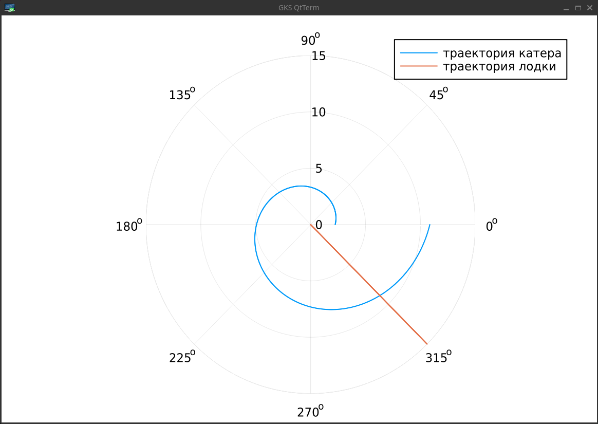
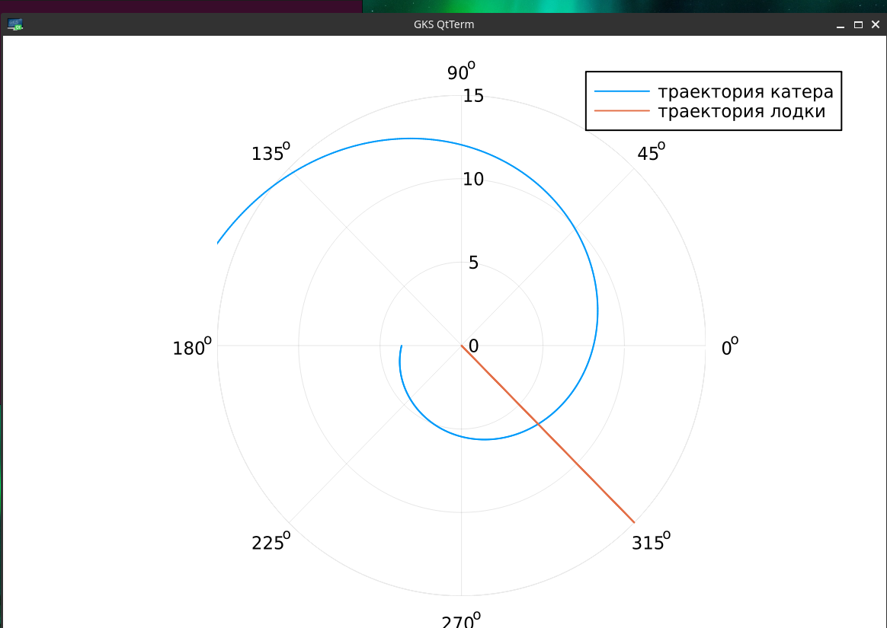

---
## Front matter
title: "Отчет по лабораторной работе №2"
subtitle: "Математическое моделирование"
author: "Амуничников Антон, НПИбд-01-22"

## Generic otions
lang: ru-RU
toc-title: "Содержание"

## Bibliography
bibliography: bib/cite.bib
csl: pandoc/csl/gost-r-7-0-5-2008-numeric.csl

## Pdf output format
toc: true # Table of contents
toc-depth: 2
lof: true # List of figures
lot: false # List of tables
fontsize: 12pt
linestretch: 1.5
papersize: a4
documentclass: scrreprt
## I18n polyglossia
polyglossia-lang:
  name: russian
  options:
	- spelling=modern
	- babelshorthands=true
polyglossia-otherlangs:
  name: english
## I18n babel
babel-lang: russian
babel-otherlangs: english
## Fonts
mainfont: IBM Plex Serif
romanfont: IBM Plex Serif
sansfont: IBM Plex Sans
monofont: IBM Plex Mono
mathfont: STIX Two Math
mainfontoptions: Ligatures=Common,Ligatures=TeX,Scale=0.94
romanfontoptions: Ligatures=Common,Ligatures=TeX,Scale=0.94
sansfontoptions: Ligatures=Common,Ligatures=TeX,Scale=MatchLowercase,Scale=0.94
monofontoptions: Scale=MatchLowercase,Scale=0.94,FakeStretch=0.9
mathfontoptions:
## Biblatex
biblatex: true
biblio-style: "gost-numeric"
biblatexoptions:
  - parentracker=true
  - backend=biber
  - hyperref=auto
  - language=auto
  - autolang=other*
  - citestyle=gost-numeric
## Pandoc-crossref LaTeX customization
figureTitle: "Рис."
tableTitle: "Таблица"
listingTitle: "Листинг"
lofTitle: "Список иллюстраций"
lotTitle: "Список таблиц"
lolTitle: "Листинги"
## Misc options
indent: true
header-includes:
  - \usepackage{indentfirst}
  - \usepackage{float} # keep figures where there are in the text
  - \floatplacement{figure}{H} # keep figures where there are in the text
---

# Цель работы

Построить математическую модель для выбора правильной стратегии при
решении примера задачи поиска.

# Теоретическое введение

Кривая погони — кривая, представляющая собой решение задачи о «погоне», которая ставится следующим образом. Пусть точка 
A равномерно движется по некоторой заданной кривой. Требуется найти траекторию равномерного движения точки P
такую, что касательная, проведённая к траектории в любой момент движения, проходила бы через соответствующее этому моменту положение точки А. Задача о кривой погони поставлена Леонардо да Винчи и решена Бугером в 1732 году.

Задача построения кривой погони впервые встала при выборе курса судна с учётом внешних факторов (боковых ветров, течения) для оптимального достижения точки цели путешествия.

Вновь эта проблема возникла при использовании в военных целях подводных лодок, торпед, а позднее и управляемых ракет с целью достижения и поражения движущихся целей. Кроме того, кривая погони применяется в космической навигации [@wiki].

# Задание

## Определение варианта

Использую формулу для определения варианта задания (рис. [-@fig:1]).

{#fig:1 width=70%}

## Задание

**Вариант 24**

На море в тумане катер береговой охраны преследует лодку браконьеров.
Через определенный промежуток времени туман рассеивается, и лодка
обнаруживается на расстоянии 11,4 км от катера. Затем лодка снова скрывается в
тумане и уходит прямолинейно в неизвестном направлении. Известно, что скорость
катера в 4,1 раза больше скорости браконьерской лодки.

1. Запишите уравнение, описывающее движение катера, с начальными
условиями для двух случаев (в зависимости от расположения катера
относительно лодки в начальный момент времени).
2. Постройте траекторию движения катера и лодки для двух случаев.

3. Найдите точку пересечения траектории катера и лодки 

# Выполнение лабораторной работы

## Вывод уравнения

Запишем уравнение описывающее движение катера, с начальными условиями для двух случаев (в зависимости от расположения катера относительно лодки в начальный момент времени).

1. Примем за $t_0 = 0$, $x_0 = 0$ -- место нахождения лодки браконьеров в момент обнаружения,$x_{k0} = k$ - место нахождения катера береговой охраны относительно лодки браконьеров в момент обнаружения лодки.

2. Введем полярные координаты. Считаем, что полюс - это точка обнаружения лодки браконьеров $x_{k0}$ ($\theta = x_{k0} = 0$), а полярная ось $r$ проходит через точку нахождения катера береговой охраны.

3. Траектория катера должна быть такой, чтобы и катер, и лодка все время были на одном расстоянии от полюса $\theta$ , только в этом случае траектория
катера пересечется с траекторией лодки. Поэтому для начала катер береговой охраны должен двигаться некоторое время прямолинейно, пока не окажется на том же расстоянии от полюса, что и лодка браконьеров. После этого катер береговой охраны должен двигаться вокруг полюса удаляясь от него с той же скоростью, что и лодка браконьеров.

4. Чтобы найти расстояние $x$ (расстояние после которого катер начнет двигаться вокруг полюса), необходимо составить простое уравнение. Пусть через время $t$ катер и лодка окажутся на одном расстоянииx от полюса. За это время лодка пройдет $x$ , а катер $k-x$ (или $k+x$, в зависимости от начального положения катера относительно полюса). Время, за которое они пройдут это расстояние, вычисляется как $\dfrac{x}{v}$ или $\dfrac{k-x}{4.1v}$ (во втором случае $\dfrac{k+x}{4.1v}$). Так как время одно и то же, то эти величины одинаковы. Тогда неизвестное расстояниеx можно найти из следующего уравнения:

$$
\dfrac{x}{v} = \dfrac{k-x}{4.1v} \text{ -- в первом случае}
$$
$$
\dfrac{x}{v} = \dfrac{k+x}{4.1v} \text{ -- во втором случае}
$$

Отсюда мы найдем два значения $x_1 = \dfrac{11.4}{5,1}$ и $x_2 = \dfrac{11.4}{3,1}$, задачу будем решать для двух случаев.

5. После того, как катер береговой охраны окажется на одном расстоянии от полюса, что и лодка, он должен сменить прямолинейную траекторию и начать двигаться вокруг полюса удаляясь от него со скоростью лодки $v$. Для этого скорость катера раскладываем на две составляющие: $v_{r}$ - радиальная скорость и  - $v_{\tau}$ тангенциальная скорость. Радиальная скорость - это скорость, с которой катер удаляется от полюса, $v_r = \dfrac{dr}{dt}$. Нам нужно, чтобы эта скорость была равна скорости лодки, поэтому полагаем $\dfrac{dr}{dt} = v$.

Тангенциальная скорость – это линейная скорость вращения катера относительно полюса. Она равна произведению угловой скорости $\dfrac{d \theta}{dt}$ на радиус $r$, $r \dfrac{d \theta}{dt}$.

Получаем: 

$$v_{\tau} = \sqrt{16.81v^2-v^2} = \sqrt{15.81}v$$

Из чего можно вывести:

$$
r\dfrac{d \theta}{dt} = \sqrt{15.81}v
$$

6. Решение исходной задачи сводится к решению системы из двух дифференциальных уравнений:

$$\begin{cases}
&\dfrac{dr}{dt} = v\\
&r\dfrac{d \theta}{dt} = \sqrt{15.81}v
\end{cases}$$

С начальными условиями для первого случая:

$$\begin{cases}
&{\theta}_0 = 0\\  \tag{1}
&r_0 = \dfrac{11.4}{5.1}
\end{cases}$$

Или для второго:

$$\begin{cases}
&{\theta}_0 = -\pi\\  \tag{2}
&r_0 = \dfrac{11.4}{3.1}
\end{cases}$$

Исключая из полученной системы производную по $t$, можно перейти к следующему уравнению:

$$
\dfrac{dr}{d \theta} = \dfrac{r}{\sqrt{15.81}}
$$

Начальные условия остаются прежними. Решив это уравнение, мы получим траекторию движения катера в полярных координатах.

## Построение модели

Построим математическую модель на языке Julia. Воспользуемся библиотеками `OrdinaryDiffEq, Plots`

Введем известные данные: 

```Julia
k = 11.4 // расстояние  от лодки до катера

// данные для лодки браконьеров
fi = 3*pi/4 
t = 0:0.01:15
fl(t) = tan(fi)*t //функция, описывающая движение лодки браконьеров

f(u, p, t) = u/sqrt(15.81) // функция, описывающая движение катера береговой охраны

// начальные условия для двух случаев
x1 = k/5.1 
x2 = k/3.1

tetha1 = (0.0, 2*pi)
tetha2 = (-pi, pi)

```

Обозначим и решим задачу для первого случая:

```Julia
 
s1 = ODEProblem(f, x1, tetha1)

sol1 = solve(s1, Tsit5(), saveat=0.01)

```
Построим график с траекторией движения катера и лодки (рис. [-@fig:2]):


```Julia
plot(sol1.t, sol1.u, proj=:polar, lims=(0,15), label="траектория катера")

plot!(fill(fi, length(t)), fl.(t), label="траектория лодки")

```

{#fig:2 width=70%}


Обозначим и решим задачу для второго случая:

```Julia

s2 = ODEProblem(f, x2, tetha2)

sol2 = solve(s2, Tsit5(), saveat=0.01)

```

Построим график с траекторией движения катера и лодки (рис. [-@fig:3]):

```Julia
plot(sol2.t, sol2.u, proj=:polar, lims=(0,15), label="траектория катера")

plot!(fill(fi, length(t)), fl.(t), label="траектория лодки")

```

{#fig:3 width=70%}

## Вывод точки пересечения

Найдем точку пересечения траектории катера и лодки. Для этого найдем аналитическое решение дифференциального уравнения, задающего траекторию движения катера. Решив задачу Коши, получим для первого случая

$$
r=\dfrac{38\,{e}^{\frac{10\,x}{\sqrt{1581}}}}{17}
$$

и для второго случая

$$
r=\dfrac{114\,{e}^{\frac{10\,x}{\sqrt{1581}}+\frac{10\,\pi}{\sqrt{1581}}}}{31}
$$

Найдем точку пересечения для первого случая:

```Julia
y(x)=(38*exp(10*x)/(sqrt(1581)))/(17)
y(fi)
// точка пересечения лодки и катера для 1 случая
9.609292077117887e8
```

Найдем точку пересечения для второго случая:

```Julia

y2(x)=(114*exp((10*x/sqrt(1581))+(10*pi/sqrt(1581))))/(31)
y2(fi-pi)
// точка пересечения лодки и катера для 2 случая
6.651143558300665

```

# Выводы

Изучена задача погони. Была построена математическая модель для выбора правильной стратегии при
решении примера задачи поиска.

