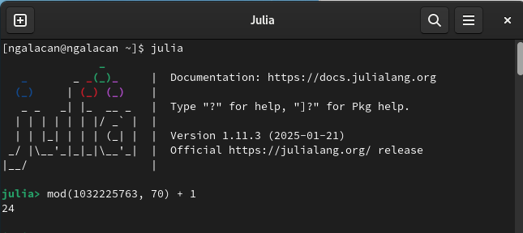
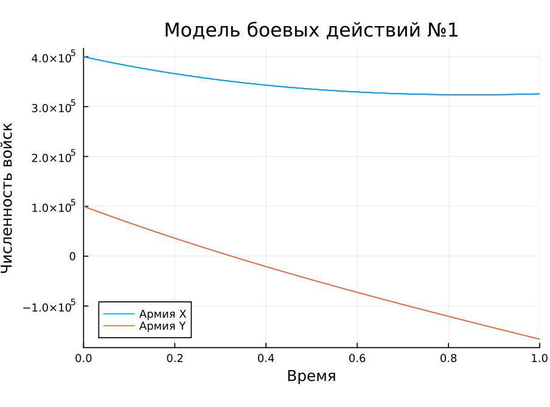
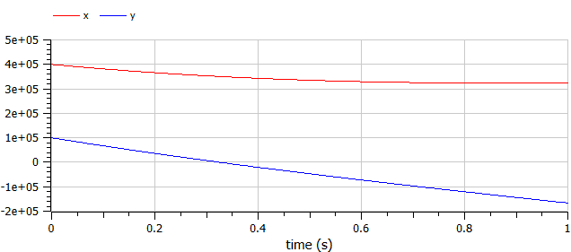
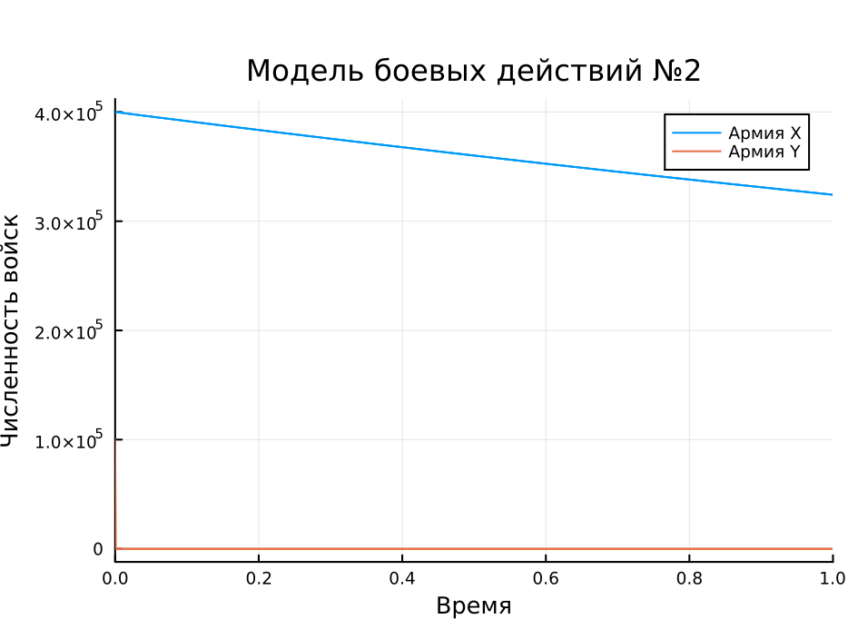
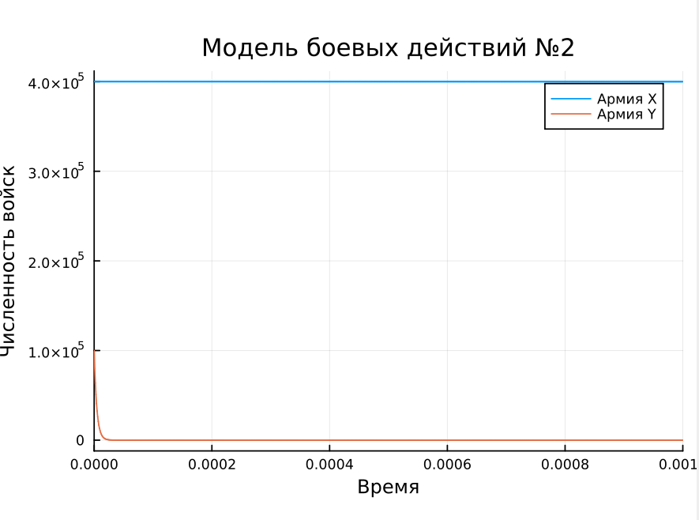
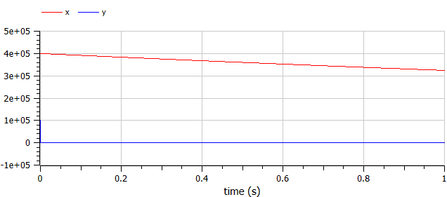
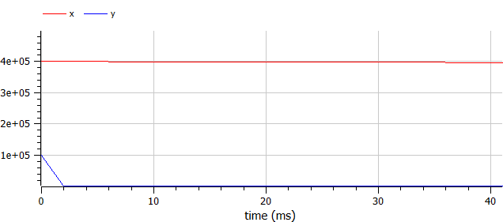

---
## Front matter
lang: ru-RU
title: Презентация по лабораторной работе №
subtitle: ""
author:
  - Амуничников Антон
institute:
  - Российский университет дружбы народов, Москва, Россия

## i18n babel
babel-lang: russian
babel-otherlangs: english

## Formatting pdf
toc: false
toc-title: Содержание
slide_level: 2
aspectratio: 169
section-titles: true
theme: metropolis
header-includes:
 - \metroset{progressbar=frametitle,sectionpage=progressbar,numbering=fraction}
 - '\makeatletter'
 - '\makeatother'
---


## Докладчик

  * Амуничников Антон Игоревич
  * 1132227133
  * уч. группа: НПИбд-01-22
  * Факультет физико-математических и естественных наук
  * Российский университет дружбы народов

## Цели и задачи

Построить математическую модель боевых действий.

##  Определение варианта

{#fig:1 width=70%}

# Модель боевых действий между регулярными войсками

## Модель боевых действий между регулярными войсками

$$\begin{cases}
    \dfrac{dx}{dt} = -0.31x(t)- 0.76y(t)+sin(3t)\\
    \dfrac{dy}{dt} = -0.8x(t)- 0.21y(t)+cos(4t)+2
\end{cases}$$

Потери, не связанные с боевыми действиями, описывают члены $-0.31x(t)$ и $-0.21y(t)$ (коэффиценты при $x$ и $y$ - это величины, характеризующие степень влияния различных факторов на потери), члены $-0.76y(t)$ и $-0.8x(t)$ отражают потери на поле боя (коэффиценты при  $x$ и $y$ указывают на эффективность боевых действий со стороны у и х соответственно). Функции P(t) = sin(3t), Q(t) = cos(4t)+2 учитывают
возможность подхода подкрепления к войскам Х и У в течение одного дня.

## Выполнение лабораторной работы

```Julia
using DifferentialEquations, Plots

function sys_reg(u, p, t)
       x, y = u
       a, b, c, h = p
       dx = -a*x - b*y + sin(3*t)
       dy = -c*x -h*y + cos(4*t) + 2
       return [dx, dy]
       end
```

## Выполнение лабораторной работы

```Julia

u0 = [400000, 100000]
p = [0.31, 0.76, 0.8, 0.21]
tspan = (0,1)

problem1 = ODEProblem(sys_reg, u0, tspan, p)
sol1 = solve(problem1)

plot(sol1, title = "Модель боевых действий №1",  label = ["Армия X" "Армия Y"],
     xaxis = "Время", yaxis = "Численность войск")

```


## Выполнение лабораторной работы

{#fig:2 width=70%}

## Выполнение лабораторной работы

```
model lab3_1
  parameter Real a = 0.31;
  parameter Real b = 0.76;
  parameter Real c = 0.8;
  parameter Real h = 0.21;
  parameter Real x0 = 400000;
  parameter Real y0 = 100000;
  Real x(start=x0);
  Real y(start=y0);
equation
  der(x) = -a*x - b*y+sin(3*time);
  der(y) = -c*x -h*y+cos(4*time)+2;
end lab3_1;

```

## Выполнение лабораторной работы

{#fig:3 width=70%}

# Модель боевых действий с участием регулярных войск и партизанских отрядов

$$\begin{cases}
    \dfrac{dx}{dt} = -0.21x(t)-0.7y(t)+sin(10t)\\
    \dfrac{dy}{dt} = -0.56x(t)y(t)-0.15y(t)+cos(10t)
\end{cases}$$

В этой системе все величины имеют тот же смысл, что и в первой модели.

## Выполнение лабораторной работы

```Julia
 
function sys_reg_part(u, p, t)
              x, y = u
              a, b, c, h = p
              dx = -a*x - b*y + sin(10*t)
              dy = -c*x*y - h*y + cos(10*t)
              return[dx, dy]
              end

```

## Выполнение лабораторной работы

```Julia

u1 = [400000, 100000]
p = [0.21, 0.7, 0.56, 0.15]
tspan = (0, 1)

problem2 = ODEProblem(sys_reg_part, u1, tspan, p)
sol2 = solve(problem2)

plot(sol2, title = "Модель боевых действий №2", label = ["Армия X" "Армия Y"], 
     xaxis = "Время", yaxis = "Численность войск", legend = :topright)

```

## Выполнение лабораторной работы


{#fig:4 width=70%}

## Выполнение лабораторной работы

{#fig:5 width=70%}

## Выполнение лабораторной работы

```
model lab3_2
  parameter Real a = 0.21;
  parameter Real b = 0.7;
  parameter Real c = 0.56;
  parameter Real h = 0.15;
  parameter Real x0 = 400000;
  parameter Real y0 = 100000;
  Real x(start=x0);
  Real y(start=y0);
equation
  der(x) = -a*x - b*y+sin(10*time);
  der(y) = -c*x*y -h*y+cos(10*time);
end lab3_2;

```

## Выполнение лабораторной работы

{#fig:6 width=70%}

## Выполнение лабораторной работы

{#fig:7 width=70%}


## Выводы

В результате выполнения работы построена математическая модель боевых действий с использованием Julia и OpenModelica.


