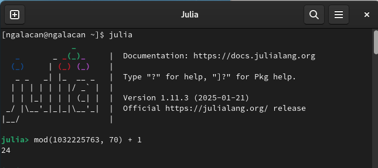
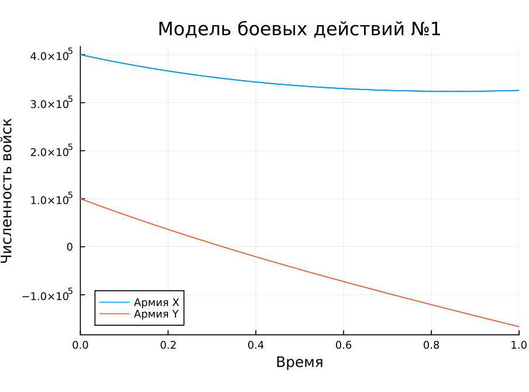
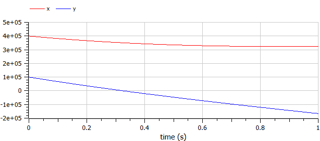
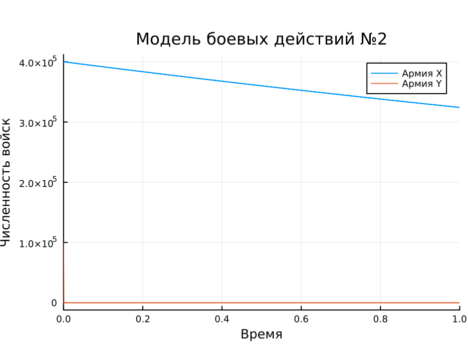
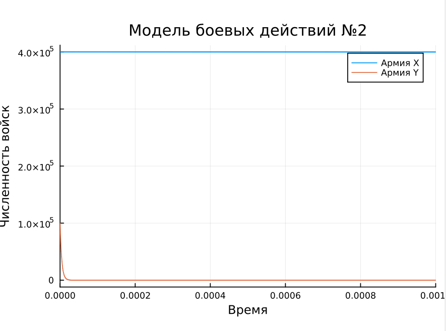
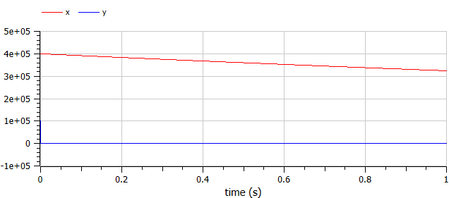
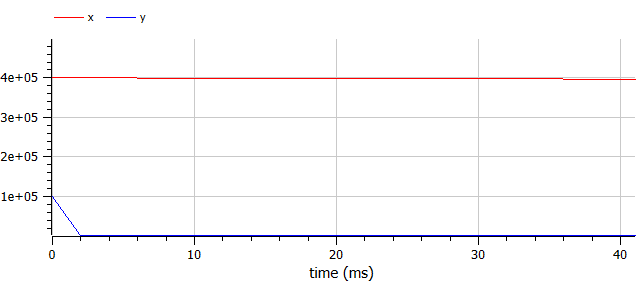

---
## Front matter
title: "Отчет по лабораторной работе № "
subtitle: "Математическое моделирование"
author: "Амуничников Антон, НПИбд-01-22"

## Generic otions
lang: ru-RU
toc-title: "Содержание"

## Bibliography
bibliography: bib/cite.bib
csl: pandoc/csl/gost-r-7-0-5-2008-numeric.csl

## Pdf output format
toc: true # Table of contents
toc-depth: 2
lof: true # List of figures
lot: false # List of tables
fontsize: 12pt
linestretch: 1.5
papersize: a4
documentclass: scrreprt
## I18n polyglossia
polyglossia-lang:
  name: russian
  options:
	- spelling=modern
	- babelshorthands=true
polyglossia-otherlangs:
  name: english
## I18n babel
babel-lang: russian
babel-otherlangs: english
## Fonts
mainfont: IBM Plex Serif
romanfont: IBM Plex Serif
sansfont: IBM Plex Sans
monofont: IBM Plex Mono
mathfont: STIX Two Math
mainfontoptions: Ligatures=Common,Ligatures=TeX,Scale=0.94
romanfontoptions: Ligatures=Common,Ligatures=TeX,Scale=0.94
sansfontoptions: Ligatures=Common,Ligatures=TeX,Scale=MatchLowercase,Scale=0.94
monofontoptions: Scale=MatchLowercase,Scale=0.94,FakeStretch=0.9
mathfontoptions:
## Biblatex
biblatex: true
biblio-style: "gost-numeric"
biblatexoptions:
  - parentracker=true
  - backend=biber
  - hyperref=auto
  - language=auto
  - autolang=other*
  - citestyle=gost-numeric
## Pandoc-crossref LaTeX customization
figureTitle: "Рис."
tableTitle: "Таблица"
listingTitle: "Листинг"
lofTitle: "Список иллюстраций"
lotTitle: "Список таблиц"
lolTitle: "Листинги"
## Misc options
indent: true
header-includes:
  - \usepackage{indentfirst}
  - \usepackage{float} # keep figures where there are in the text
  - \floatplacement{figure}{H} # keep figures where there are in the text
---

# Цель работы

Построить математическую модель боевых действий.

# Теоретическое введение

Моделирование боевых действий - метод военно-теоретического или военно-технического исследования объектов (систем, явлений, событий, процессов), участвующих (происходящих) в ходе боевых действий, путём создания и изучения их моделей (аналогов) в целях получения знаний о физич., информац. и иных процессах вооруж. борьбы, а также для сравнения вариантов решений командующих (командиров), планов и прогнозов ведения боевых действий, оценки влияния на них различных факторов.

В зависимости от целей создания и предназначения модели подразделяют на исследовательское, управленч., штабное (адм.), обучающее (учебное). По масштабу моделирование бывает стратегическим, оперативным и тактическим. По природе используемых моделей и сфере их применения различают моделирование материальное (предметное) и идеальное.

Моделирование боевых действий наиболее широко применяется в интересах обоснования принимаемых решений в области управления войсками (силами) при подготовке и ведении боевых действий, строительстве вооруженных сил, разработке программ развития вооружений, а также при оценке эффективности использования новых образцов оружия, оперативной подготовке штабов и др. [@enc].

Законы Ланчестера (законы Осипова — Ланчестера) — математическая формула для расчета относительных сил пары сражающихся сторон — подразделений вооруженных сил. В статье «Влияние численности сражающихся сторон на их потери», опубликованной журналом «Военный сборник» в 1915 году, генерал-майор Корпуса военных топографов М. П. Осипов описал математическую модель глобального вооружённого противостояния, практически применяемую в военном деле при описании убыли сражающихся сторон с течением времени и, входящую в математическую теорию исследования операций, на год опередив английского математика Ф. У. Ланчестера. 

Уравнения Ланчестера — это дифференциальные уравнения, описывающие зависимость между силами сражающихся сторон A и D как функцию от времени, причем функция зависит только от A и D [@wiki].

# Задание

## Определение варианта

Использую формулу для определения варианта задания (рис. [-@fig:1]).

{#fig:1 width=70%}

## Задание

**Вариант 24**

Между страной $X$ и страной $Y$ идет война. Численность состава войск
исчисляется от начала войны, и являются временными функциями $x(t)$ и $y(t)$. В
начальный момент времени страна $X$ имеет армию численностью 400 000 человек,
а в распоряжении страны $Y$ армия численностью в 100 000 человек. Для упрощения
модели считаем, что коэффициенты $a, b, c, h$ постоянны. Также считаем $P(t)$ и $Q(t)$ непрерывные функции.

Построить графики изменения численности войск армии $X$ и армии $Y$ для  следующих случаев:

1. Модель боевых действий между регулярными войсками
$$\begin{cases}
    \dfrac{dx}{dt} = -0.31x(t)- 0.76y(t)+sin(3t)\\
    \dfrac{dy}{dt} = -0.8x(t)- 0.21y(t)+cos(4t)+2
\end{cases}$$

2. Модель ведение боевых действий с участием регулярных войск и партизанских отрядов

$$\begin{cases}
    \dfrac{dx}{dt} = -0.21x(t)-0.7y(t)+sin(10t)\\
    \dfrac{dy}{dt} = -0.56x(t)y(t)-0.15y(t)+cos(10t)
\end{cases}$$

# Выполнение лабораторной работы

## Модель боевых действий между регулярными войсками

Модель описывается уравнениями:

$$\begin{cases}
    \dfrac{dx}{dt} = -0.31x(t)- 0.76y(t)+sin(3t)\\
    \dfrac{dy}{dt} = -0.8x(t)- 0.21y(t)+cos(4t)+2
\end{cases}$$

Потери, не связанные с боевыми действиями, описывают члены $-0.31x(t)$ и $-0.21y(t)$ (коэффиценты при $x$ и $y$ - это величины, характеризующие степень влияния различных факторов на потери), члены $-0.76y(t)$ и $-0.8x(t)$ отражают потери на поле боя (коэффиценты при  $x$ и $y$ указывают на эффективность боевых действий со стороны у и х соответственно). Функции P(t) = sin(3t), Q(t) = cos(4t)+2 учитывают
возможность подхода подкрепления к войскам Х и У в течение одного дня.

Построим эту модель на Julia. Подключим библиотеки:

```Julia
using DifferentialEquations, Plots

```

Составим функцию для создания системы уравнений:

```Julia
 
function sys_reg(u, p, t)
       x, y = u
       a, b, c, h = p
       dx = -a*x - b*y + sin(3*t)
       dy = -c*x -h*y + cos(4*t) + 2
       return [dx, dy]
       end

```

Введем параметры:

```Julia

u0 = [400000, 100000]
p = [0.31, 0.76, 0.8, 0.21]
tspan = (0,1)

```

Обозначим и решим задачу:

```Julia
problem1 = ODEProblem(sys_reg, u0, tspan, p)

sol1 = solve(problem1)

```

Построим график (рис. [-@fig:2]):


```Julia

plot(sol1, title = "Модель боевых действий №1",  label = ["Армия X" "Армия Y"],
     xaxis = "Время", yaxis = "Численность войск")

```

{#fig:2 width=70%}


Из графика видно, что численность армии Y стала нулевой, что означает победу армии Х. Несмотря на это, после победы численность армии Х продолжает сокращаться, однако с меньшей интенсивностью. Это обусловливается наличием не связанных с боевыми действиями факторов (болезни, травмы, дезертирство).

Смоделируем то же самое на OpenModelica:


```
model lab3_1
  parameter Real a = 0.31;
  parameter Real b = 0.76;
  parameter Real c = 0.8;
  parameter Real h = 0.21;
  parameter Real x0 = 400000;
  parameter Real y0 = 100000;
  Real x(start=x0);
  Real y(start=y0);
  
equation
  der(x) = -a*x - b*y+sin(3*time);
  der(y) = -c*x -h*y+cos(4*time)+2;
  
end lab3_1;

```

Получим схожий график изменения численности армий (рис. [-@fig:3]):

{#fig:3 width=70%}

Выводы аналогичны: победу одержала армия Х.

## Модель боевых действий с участием регулярных войск и партизанских отрядов

Во втором случае в борьбу добавляются партизанские отряды. Нерегулярные
войска в отличии от постоянной армии менее уязвимы, так как действуют скрытно,
в этом случае сопернику приходится действовать неизбирательно, по площадям,
занимаемым партизанами. Поэтому считается, что тем потерь партизан,
проводящих свои операции в разных местах на некоторой известной территории,
пропорционален не только численности армейских соединений, но и численности
самих партизан. В результате модель принимает вид:

$$\begin{cases}
    \dfrac{dx}{dt} = -0.21x(t)-0.7y(t)+sin(10t)\\
    \dfrac{dy}{dt} = -0.56x(t)y(t)-0.15y(t)+cos(10t)
\end{cases}$$

В этой системе все величины имеют тот же смысл, что и в первой модели.

Построим эту модель на Julia. Составим функцию для создания системы уравнений:

```Julia
 
function sys_reg_part(u, p, t)
              x, y = u
              a, b, c, h = p
              dx = -a*x - b*y + sin(10*t)
              dy = -c*x*y - h*y + cos(10*t)
              return[dx, dy]
              end

```

Введем параметры:

```Julia

u1 = [400000, 100000]
p = [0.21, 0.7, 0.56, 0.15]
tspan = (0, 1)

```

Обозначим и решим задачу:

```Julia
problem2 = ODEProblem(sys_reg_part, u1, tspan, p)

sol2 = solve(problem2)

```

Построим график (рис. [-@fig:4]):


```Julia

plot(sol2, title = "Модель боевых действий №2", label = ["Армия X" "Армия Y"], 
     xaxis = "Время", yaxis = "Численность войск", legend = :topright)

```

{#fig:4 width=70%}


Победу одерживает армия X, причем численность армии Y уменьшается до нуля за очень короткий интервал. Армия Х после поражения У так же продолжает терять людей всилу факторов, не зависящих от военных действий. Для более детального отслеживания изменения численности армии У сократим временной интервал:

```Julia

tspan = (0, 0.001)

```

{#fig:5 width=70%}

За время, когда армия У вымерла, численность армии Х почти не изменилась.

Cмоделируем то же самое на OpenModelica:


```

model lab3_2
  parameter Real a = 0.21;
  parameter Real b = 0.7;
  parameter Real c = 0.56;
  parameter Real h = 0.15;
  parameter Real x0 = 400000;
  parameter Real y0 = 100000;
  Real x(start=x0);
  Real y(start=y0);
  
equation
  der(x) = -a*x - b*y+sin(10*time);
  der(y) = -c*x*y -h*y+cos(10*time);
  
end lab3_2;

```

Получим схожий график изменения численности армий (рис. [-@fig:6]).

{#fig:6 width=70%}

Для более детального отслеживания изменения численности армии У рассмотрим приближенный график (рис. [-@fig:7]).

{#fig:7 width=70%}

На графике теперь видно, как происходит вымирание людей в армии Y. За этот  интервал армия X почти не потеряла людей.

Сравнивая графики на Julia и OpenModelica можно заметить, что линии в Julia более плавные. Это связано с точностью вычислений: в Julia она выше.
 
# Выводы

В результате выполнения работы построена математическая модель боевых действий с использованием Julia и OpenModelica.

# Список литературы{.unnumbered}

::: {#refs}
:::
