---
## Front matter
lang: ru-RU
title: Презентация по лабораторной работе №
subtitle: ""
author:
  - Амуничников Антон
institute:
  - Российский университет дружбы народов, Москва, Россия

## i18n babel
babel-lang: russian
babel-otherlangs: english

## Formatting pdf
toc: false
toc-title: Содержание
slide_level: 2
aspectratio: 169
section-titles: true
theme: metropolis
header-includes:
 - \metroset{progressbar=frametitle,sectionpage=progressbar,numbering=fraction}
 - '\makeatletter'
 - '\makeatother'
---


## Докладчик

  * Амуничников Антон Игоревич
  * 1132227133
  * уч. группа: НПИбд-01-22
  * Факультет физико-математических и естественных наук
  * Российский университет дружбы народов

## Цели и задачи

Построить математическую модель гармонического осциллятора.

##  Определение варианта

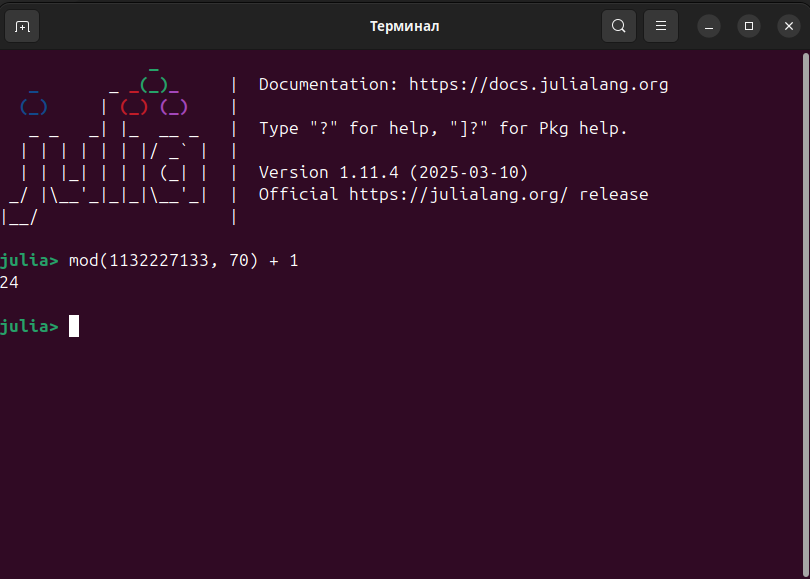{#fig:1 width=70%}

## Выполнение лабораторной работы

Уравнение свободных колебаний гармонического осциллятора имеет следующий вид:

$$
\ddot x + 2\gamma\dot x + \omega _0^2x = 0, \tag{1}
$$

# Модель колебаний гармонического осциллятора без затуханий и без действий внешней силы

## Выполнение лабораторной работы

 $$ \ddot{x} + 9x = 0 $$
 
 На интервале $t \in [0; 49]$ (шаг 0.05) с начальными условиями $x_0 = -0.5, y_0=1$.
 
## Выполнение лабораторной работы

```Julia
# Используемые библиотеки
using DifferentialEquations, Plots;
# Начальные условия
tspan = (0, 49)
u0 = [-0.5, 1]
p1 = [0, 9]
# Задание функции
function f1(u, p, t)
    x, y = u
    g, w = p
    dx = y
    dy = -g .*y - w^2 .*x
    return [dx, dy]
end
```

## Выполнение лабораторной работы

```Julia
# Постановка проблемы и ее решение
problem1 = ODEProblem(f1, u0, tspan, p1)
sol1 = solve(problem1, saveat=0.05)

plot(sol1, title = "Модель гармонического осциллятора без затуханий", 
     label = ["x" "y"], xaxis="t")

plot(sol1, idxs=(1, 2), title = "Фазовый портрет", 
     label = "зависимость х от у", xaxis="x", yaxis="y")

```
 
## Выполнение лабораторной работы
 
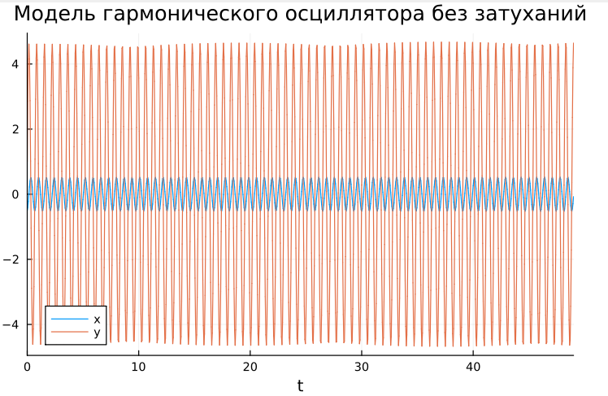{#fig:2 width=70%} 
 
## Выполнение лабораторной работы

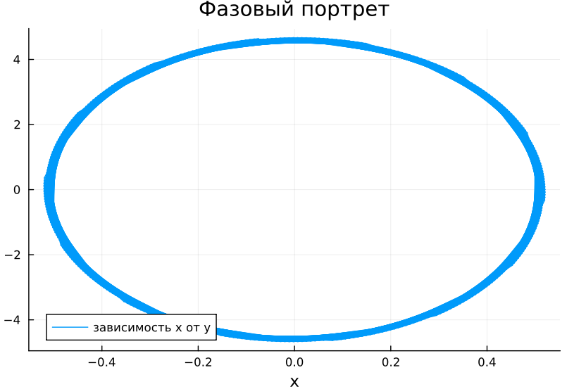{#fig:3 width=70%}

## Выполнение лабораторной работы

```
model lab4_1
  parameter Real g = 0;
  parameter Real w = 9;
  parameter Real x0 = -0.5;
  parameter Real y0 = 1;
  Real x(start=x0);
  Real y(start=y0);
equation
    der(x) = y;
    der(y) = -g .*y - w^2 .*x;
end lab4_1;
```

## Выполнение лабораторной работы

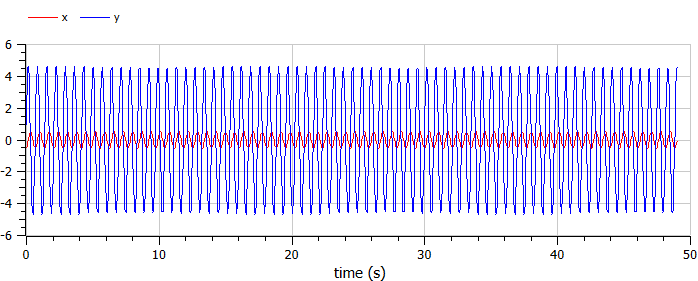{#fig:4 width=70%}

## Выполнение лабораторной работы

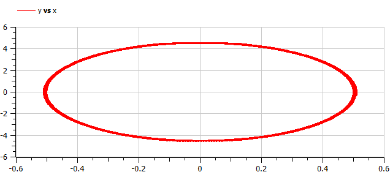{#fig:5 width=70%}

# Модель колебаний гармонического осциллятора c затуханием и без действий внешней силы 


## Выполнение лабораторной работы

$$\ddot x + \dot x + 4.9 x = 0 $$

На интервале $t \in [0; 49]$ (шаг 0.05) с начальными условиями $x_0 = -0.5, y_0=1$.

## Выполнение лабораторной работы

```Julia

# Начальные условия
p2 = [1, 4.9]

# Постановка проблемы и ее решение
problem2 = ODEProblem(f1, u0, tspan, p2)
sol2 = solve(problem2, saveat=0.05)

```

## Выполнение лабораторной работы

```Julia
plot(sol2, title = "Модель гармонического осциллятора с затуханиями", 
     label = ["x" "y"], xaxis="t")

plot(sol2, idxs=(1, 2), title = "Фазовый портрет", 
     label = "зависимость х от у", xaxis="x", yaxis="y")

```

## Выполнение лабораторной работы

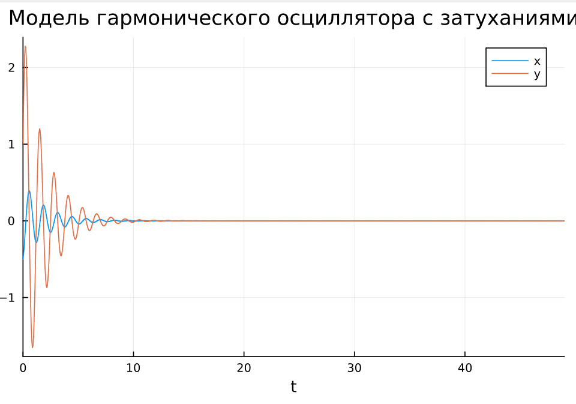{#fig:6 width=70%}

## Выполнение лабораторной работы

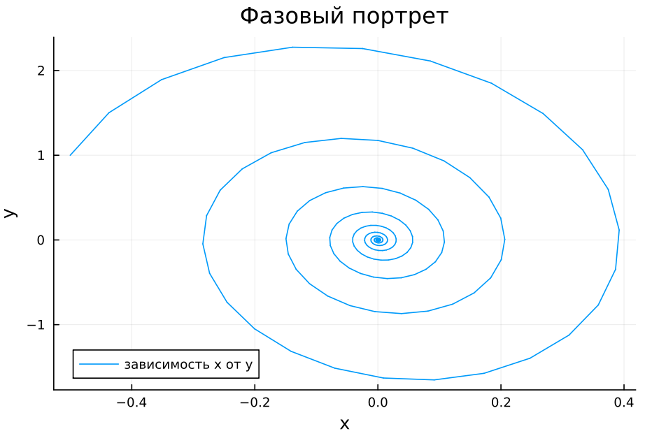{#fig:7 width=70%}

## Выполнение лабораторной работы

```
model lab4_2
  parameter Real g = 1;
  parameter Real w = 4.9;
  parameter Real x0 = -0.5;
  parameter Real y0 = 1;
  Real x(start=x0);
  Real y(start=y0);
equation
    der(x) = y;
    der(y) = -g .*y - w^2 .*x;
end lab4_2;

```

## Выполнение лабораторной работы

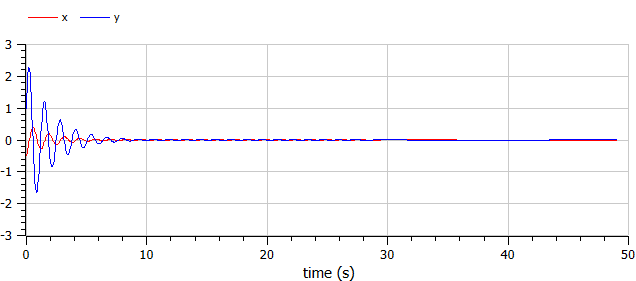{#fig:8 width=70%}

## Выполнение лабораторной работы

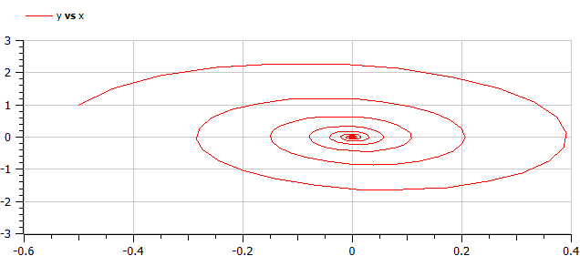{#fig:9 width=70%}


# Модель колебаний гармонического осциллятора c затуханием и под действием внешней силы

## Выполнение лабораторной работы

$$\ddot x + \dot x + 5.9 x = 9.9 sin(t)$$
   
На интервале $t \in [0; 49]$ (шаг 0.05) с начальными условиями $x_0 = -0.5,  y_0=1$.

## Выполнение лабораторной работы

```Julia

# Начальные условия
p3 = [1, 5.9]
# Функция, описывающая внешние силы, действующие на осциллятор
f(t) = 9.9*sin(t)
# Задание функции
function f2(u, p, t)
       x, y = u
       g, w = p
       dx = y
       dy = -g .*y - w^2 .*x .+f(t)
       return [dx, dy]
end
```

## Выполнение лабораторной работы

```
# Постановка проблемы и ее решение
problem3 = ODEProblem(f2, u0, tspan, p3)
sol3 = solve(problem3, Tsit5(), saveat = 0.05)

plot(sol3, title = "Модель гарм. осц. с затуханиями под действием вн. силы", 
     label = ["x" "y"], xaxis="t")

plot(sol3, idxs=(1,2), title = "Фазовый портрет", 
     label = "зависимость х от у", xaxis="x", yaxis="y")

```

## Выполнение лабораторной работы

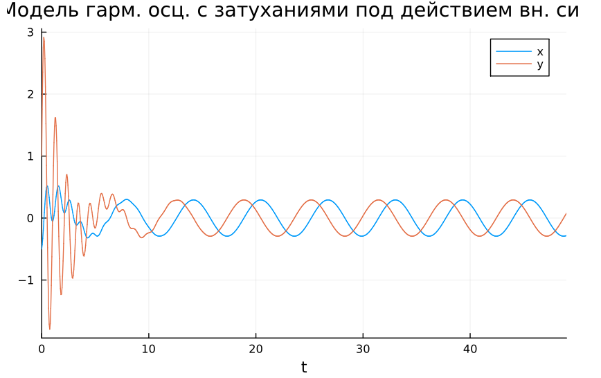{#fig:10 width=70%}

## Выполнение лабораторной работы

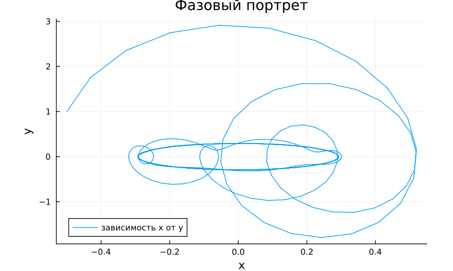{#fig:11 width=70%}

## Выполнение лабораторной работы

```
model lab4_3
  parameter Real g = 1;
  parameter Real w = 5.9;
  parameter Real x0 = -0.5;
  parameter Real y0 = 1;
  Real x(start=x0);
  Real y(start=y0);
equation
    der(x) = y;
    der(y) = -g .*y - w^2 .*x + 9.9*sin(time);
end lab4_3;
```

## Выполнение лабораторной работы

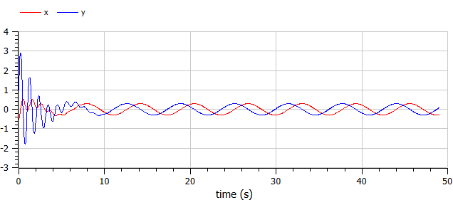{#fig:12 width=70%}

## Выполнение лабораторной работы

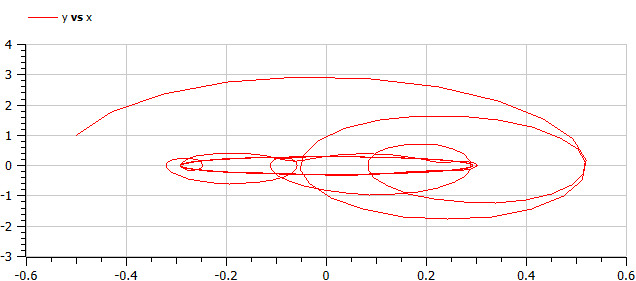{#fig:13 width=70%}

## Выводы

Построена математическая модель гармонического осциллятора и проведен анализ.


