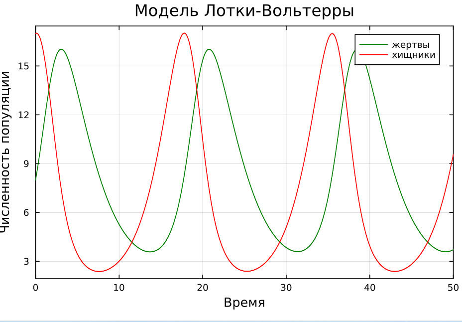
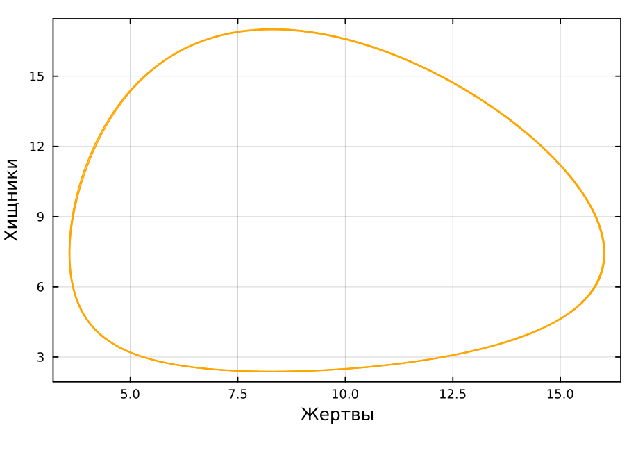
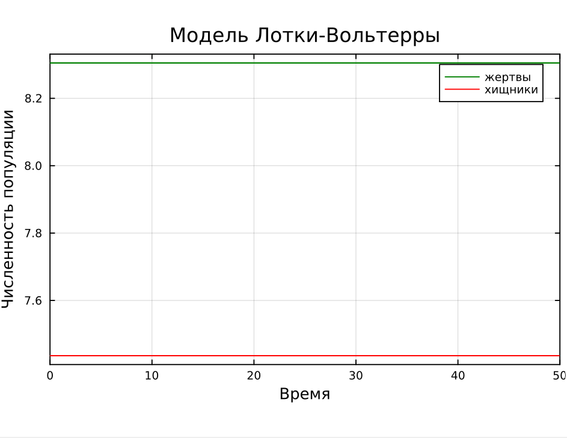
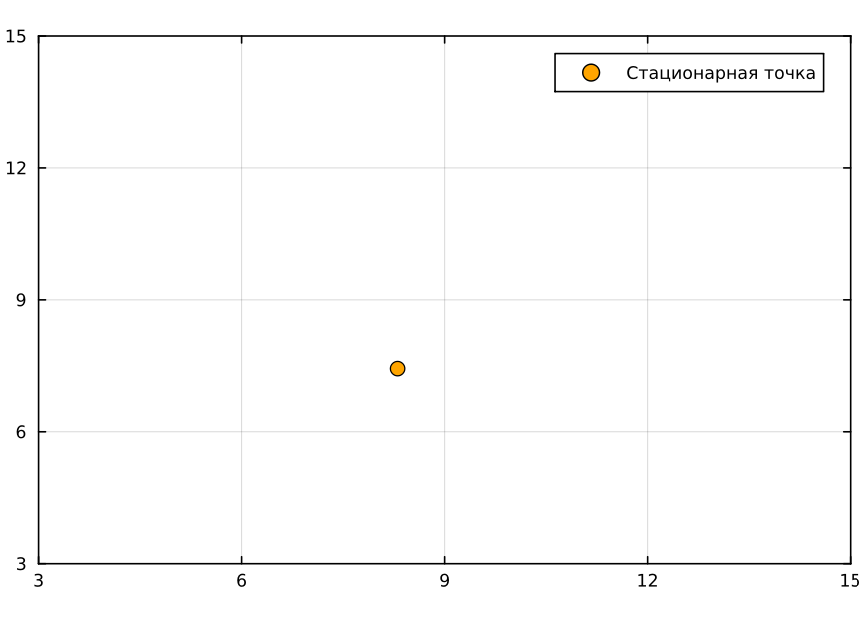
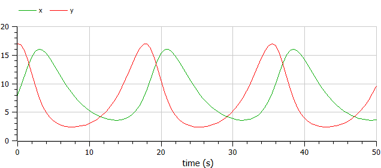
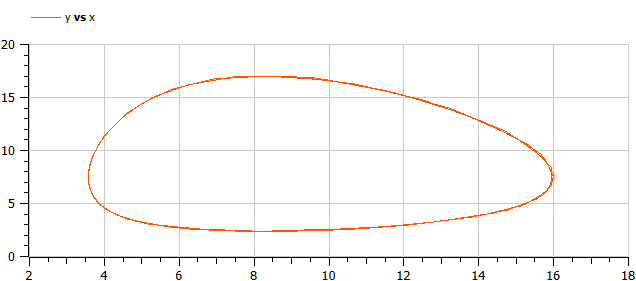
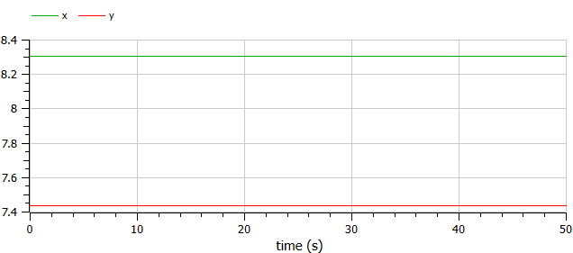
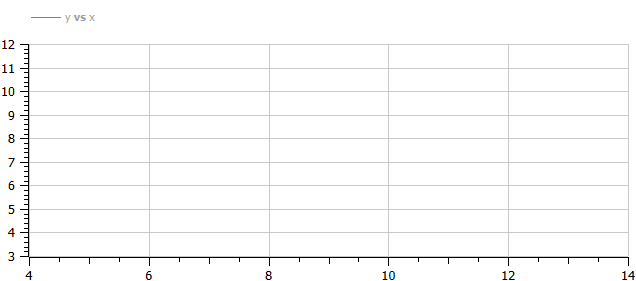

---
## Front matter
lang: ru-RU
title: Презентация по лабораторной работе №5
subtitle: ""
author:
  - Амуничников Антон
institute:
  - Российский университет дружбы народов, Москва, Россия

## i18n babel
babel-lang: russian
babel-otherlangs: english

## Formatting pdf
toc: false
toc-title: Содержание
slide_level: 2
aspectratio: 169
section-titles: true
theme: metropolis
header-includes:
 - \metroset{progressbar=frametitle,sectionpage=progressbar,numbering=fraction}
 - '\makeatletter'
 - '\makeatother'
---


## Докладчик

  * Амуничников Антон Игоревич
  * 1132227133
  * уч. группа: НПИбд-01-22
  * Факультет физико-математических и естественных наук
  * Российский университет дружбы народов

## Цели и задачи

Исследовать математическую модель Лотки-Вольерры.


## Задание

Для модели «хищник-жертва»:

$$\begin{cases}
    &\dfrac{dx}{dt} = - 0.29 x(t) + 0.039 x(t)y(t) \\
    &\dfrac{dy}{dt} = 0.49 y(t) - 0.059 x(t)y(t)
\end{cases}$$

Построить график зависимости численности хищников от численности жертв,
а также графики изменения численности хищников и численности жертв при
следующих начальных условиях:
$x_0 = 8, y_0 = 17.$ 
Найти стационарное состояние системы.


## Выполнение лабораторной работы

```julia
# используемые библиотеки
using DifferentialEquations, Plots

# создание системы ДУ, описывающей модель Лотки-Вольтерры
function LV(u, p, t)
       x, y = u
       a, b, c, d = p
       dx = -a*x + b*x*y
       dy = c*y - d*x*y
       return [dx, dy]
end
```


## Выполнение лабораторной работы

```
# начальные условия
u0 = [8, 17]
p = [0.29, 0.039, 0.49, 0.059]
tspan = (0.0, 50.0)

# постановка задачи и ее решение
prob = ODEProblem(LV, u0, tspan, p)
sol = solve(prob)
```

## Выполнение лабораторной работы

```julia
plot(sol, title = "Модель Лотки-Вольтерры", xaxis = "Время", 
     yaxis = "Численность популяции", label = ["жертвы" "хищники"], 
     c = ["green" "red"], box =:on)

plot(sol, idxs=(1, 2),  xaxis = "Жертвы", yaxis = "Хищники",  
     c = "orange", box =:on, legend = false)

```

## Выполнение лабораторной работы

{#fig:2 width=70%}

## Выполнение лабораторной работы

{#fig:3 width=70%}

## Выполнение лабораторной работы

$$\begin{cases}
  &x_0 = \dfrac{\gamma}{\delta}\\
  &y_0 = \dfrac{\alpha}{\beta}
\end{cases}
$$

В результате, $x_0 = \dfrac{0.49}{0.059} = 8.305084745762713$, а $y_0 = \dfrac{0.29}{0.039}=7.435897435897435$

## Выполнение лабораторной работы


```julia
xs = p[3]/p[4]
ys = p[1]/p[2]
u0_s = [xs, ys]
prob2 = ODEProblem(LV, u0_s, tspan, p)
sol2 = solve(prob2)
```

## Выполнение лабораторной работы


```julia
plot(sol2, title = "Модель Лотки-Вольтерры", xaxis = "Время", 
     yaxis = "Численность популяции", label = ["жертвы" "хищники"], 
     c = ["green" "red"], box =:on)

```

## Выполнение лабораторной работы

{#fig:4 width=70%}

## Выполнение лабораторной работы

```julia

plot((xs, ys), seriestype=:scatter, xlims=(3, 15), ylims=(3, 15),
     box=:on, c="orange", markersize=5, label="Стационарная точка")

```

## Выполнение лабораторной работы

{#fig:5 width=70%}

## Выполнение лабораторной работы

```
model lab5_1
  parameter Real a = 0.29;
  parameter Real b = 0.039;
  parameter Real c = 0.49;
  parameter Real d = 0.059;
  parameter Real x0 = 8;
  parameter Real y0 = 17;
  Real x(start=x0);
  Real y(start=y0);
equation
    der(x) = -a*x + b*x*y;
    der(y) = c*y - d*x*y;
end lab5_1;
```

## Выполнение лабораторной работы

{#fig:6 width=70%}

## Выполнение лабораторной работы

{#fig:7 width=70%}

## Выполнение лабораторной работы

```
model lab5_2
  parameter Real a = 0.29;
  parameter Real b = 0.039;
  parameter Real c = 0.49;
  parameter Real d = 0.059;
  parameter Real x0 = 0.49/0.059;
  parameter Real y0 = 0.29/0.039;
  Real x(start=x0);
  Real y(start=y0);
equation
    der(x) = -a*x + b*x*y;
    der(y) = c*y - d*x*y;
end lab5_2;
```

## Выполнение лабораторной работы

{#fig:8 width=70%}

## Выполнение лабораторной работы

{#fig:9 width=70%}


## Выводы

В результате выполнения работы была исследована модель Лотки-Вольтерры.


