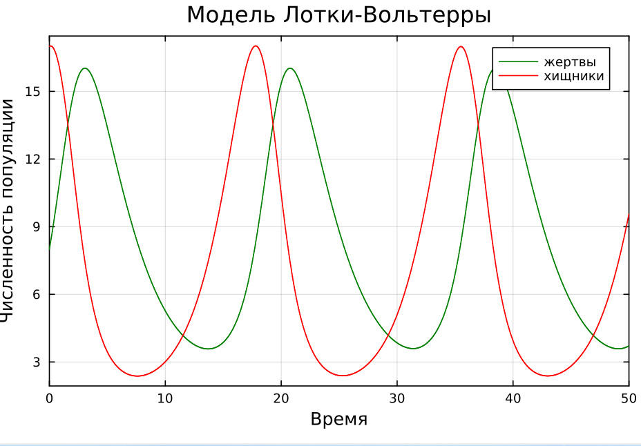
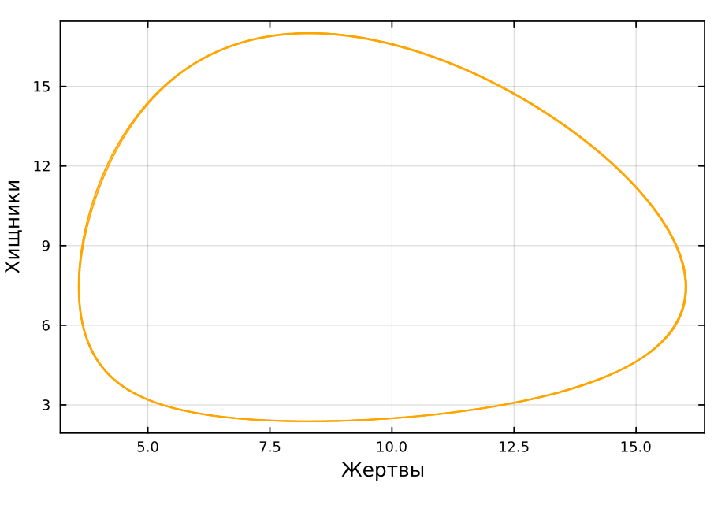
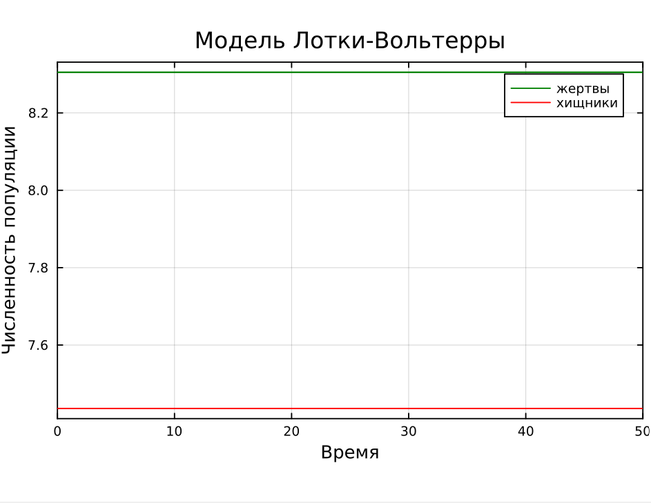
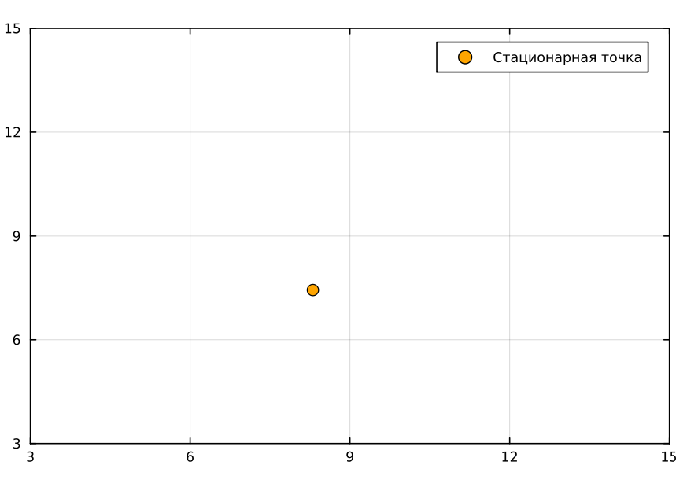
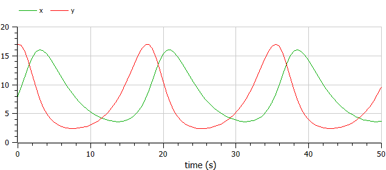
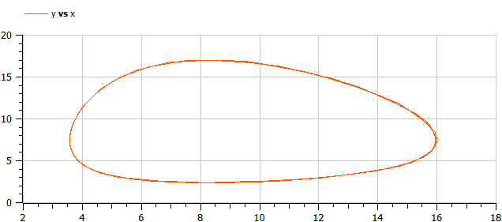
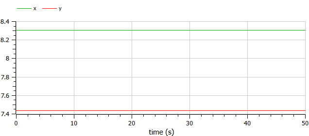
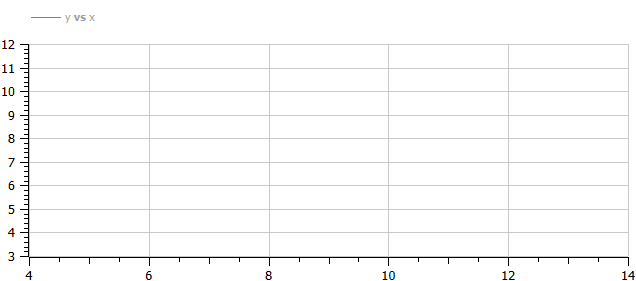

---
## Front matter
title: "Отчет по лабораторной работе № 5"
subtitle: "Математическое моделирование"
author: "Амуничников Антон, НПИбд-01-22"

## Generic otions
lang: ru-RU
toc-title: "Содержание"

## Bibliography
bibliography: bib/cite.bib
csl: pandoc/csl/gost-r-7-0-5-2008-numeric.csl

## Pdf output format
toc: true # Table of contents
toc-depth: 2
lof: true # List of figures
lot: false # List of tables
fontsize: 12pt
linestretch: 1.5
papersize: a4
documentclass: scrreprt
## I18n polyglossia
polyglossia-lang:
  name: russian
  options:
	- spelling=modern
	- babelshorthands=true
polyglossia-otherlangs:
  name: english
## I18n babel
babel-lang: russian
babel-otherlangs: english
## Fonts
mainfont: IBM Plex Serif
romanfont: IBM Plex Serif
sansfont: IBM Plex Sans
monofont: IBM Plex Mono
mathfont: STIX Two Math
mainfontoptions: Ligatures=Common,Ligatures=TeX,Scale=0.94
romanfontoptions: Ligatures=Common,Ligatures=TeX,Scale=0.94
sansfontoptions: Ligatures=Common,Ligatures=TeX,Scale=MatchLowercase,Scale=0.94
monofontoptions: Scale=MatchLowercase,Scale=0.94,FakeStretch=0.9
mathfontoptions:
## Biblatex
biblatex: true
biblio-style: "gost-numeric"
biblatexoptions:
  - parentracker=true
  - backend=biber
  - hyperref=auto
  - language=auto
  - autolang=other*
  - citestyle=gost-numeric
## Pandoc-crossref LaTeX customization
figureTitle: "Рис."
tableTitle: "Таблица"
listingTitle: "Листинг"
lofTitle: "Список иллюстраций"
lotTitle: "Список таблиц"
lolTitle: "Листинги"
## Misc options
indent: true
header-includes:
  - \usepackage{indentfirst}
  - \usepackage{float} # keep figures where there are in the text
  - \floatplacement{figure}{H} # keep figures where there are in the text
---

# Цель работы

Исследовать математическую модель Лотки-Вольерры.

# Теоретическое введение

Модель "Хищник-жертва" основывается на следующих предположениях [@Volterra:bash]:

1. Численность популяции жертв $x$ и хищников $y$ зависят только от времени (модель не учитывает пространственное распределение популяции на занимаемой территории)

2. В отсутствии взаимодействия численность видов изменяется по модели Мальтуса (экспоненциальный рост с постоянным темпом), при этом число жертв увеличивается, а число хищников падает

3. Естественная смертность жертвы и естественная рождаемость хищника считаются несущественными

4. Эффект насыщения численности обеих популяций не учитывается

5. Скорость роста численности жертв уменьшается пропорционально численности хищников

$$\begin{cases}
  &\dfrac{dx}{dt} = ax(t)-bx(t)y(t)\\
  &\dfrac{dy}{dt} = -cy(t)+dx(t)y(t)
\end{cases}$$

В этой модели $x$ – число жертв, $y$ - число хищников. Коэффициент $a$ описывает скорость естественного прироста числа жертв в отсутствие хищников, $c$ - естественное вымирание хищников, лишенных пищи в виде жертв. Вероятность взаимодействия жертвы и хищника считается пропорциональной как количеству жертв, так и числу самих хищников. Каждый акт взаимодействия уменьшает популяцию жертв, но способствует увеличению популяции хищников (члены $-bxy$ и $dxy$ в правой части уравнения). 

Найдём стационарное состояние системы. Для этого приравняем её правые части к нулю.

$$\begin{cases}
  ax(t)-bx(t)y(t) = 0\\
  -cy(t)+dx(t)y(t) = 0
\end{cases}$$

Из полученной системы получаем, что стационарное состояние системы будет в точке $x_0 = c/d$, $y_0 = a/b$. Если начальные значения задать в стационарном состоянии $x(0) = x_0$, $y(0) = y_0$, то в любой момент времени численность популяций изменяться не будет. При малом отклонении от положения равновесия численности как хищника, так и жертвы с течением времени не возвращаются к равновесным значениям, а совершают периодические колебания вокруг стационарной точки.

# Задание

## Определение варианта

Использую формулу для определения варианта задания (рис. [-@fig:1]).

{#fig:1 width=70%}

## Задание

Для модели «хищник-жертва»:

$$\begin{cases}
    &\dfrac{dx}{dt} = - 0.29 x(t) + 0.039 x(t)y(t) \\
    &\dfrac{dy}{dt} = 0.49 y(t) - 0.059 x(t)y(t)
\end{cases}$$

Построить график зависимости численности хищников от численности жертв,
а также графики изменения численности хищников и численности жертв при
следующих начальных условиях:
$x_0 = 8, y_0 = 17.$ 
Найти стационарное состояние системы.

# Выполнение лабораторной работы

Необходимо решить систему дифференциальных уравнений для построения графиков и нахождения стационарного состояния на Julia и OpenModelica.

## Julia

Напишем код программы для решения системы ДУ:

```julia
# используемые библиотеки
using DifferentialEquations, Plots

# создание системы ДУ, описывающей модель Лотки-Вольтерры
function LV(u, p, t)
       x, y = u
       a, b, c, d = p
       dx = -a*x + b*x*y
       dy = c*y - d*x*y
       return [dx, dy]
end

# начальные условия
u0 = [8, 17]
p = [0.29, 0.039, 0.49, 0.059]
tspan = (0.0, 50.0)

# постановка задачи и ее решение
prob = ODEProblem(LV, u0, tspan, p)
sol = solve(prob)
```

Построим график изменения численности хищников и численности жертв, а также график зависимости численности хищников от численности жертв:

```julia
plot(sol, title = "Модель Лотки-Вольтерры", xaxis = "Время", 
     yaxis = "Численность популяции", label = ["жертвы" "хищники"], 
     c = ["green" "red"], box =:on)

plot(sol, idxs=(1, 2),  xaxis = "Жертвы", yaxis = "Хищники",  
     c = "orange", box =:on, legend = false)

```
Просмотрим график изменения численности хищников и жертв (рис. [-@fig:2]), а также график зависимости численности хищников от численности жертв  (рис. [-@fig:3]).

{#fig:2 width=70%}

{#fig:3 width=70%}

Графики периодичны, фазовый портрет замкнут, как и должно быть в жесткой модели Лотки-Вольтерры.

Для нахождения стационарного состояния системы найдем стационарную точку в соответствии с формулами:

$$\begin{cases}
  &x_0 = \dfrac{\gamma}{\delta}\\
  &y_0 = \dfrac{\alpha}{\beta}
\end{cases}
$$

В результате, $x_0 = \dfrac{0.49}{0.059} = 8.305084745762713$, а $y_0 = \dfrac{0.29}{0.039}=7.435897435897435$

Проверим, что точка действительно является стационарная, подставив ее в начальные условия:

```julia
xs = p[3]/p[4]
ys = p[1]/p[2]
u0_s = [xs, ys]
prob2 = ODEProblem(LV, u0_s, tspan, p)
sol2 = solve(prob2)
```

Построим график изменения численности хищников и жертв (рис. [-@fig:4]):

```julia
plot(sol2, title = "Модель Лотки-Вольтерры", xaxis = "Время", 
     yaxis = "Численность популяции", label = ["жертвы" "хищники"], 
     c = ["green" "red"], box =:on)

```

{#fig:4 width=70%}

На получившемся графике видим две прямые, параллельных оси абсцисс. Это означает, что с течением времени численность хищников и жертв не изменяется, что соответствует стационарному состоянию. Следовательно, стационарная точка найдена верно.

Фазовый портрет в стационарном состоянии будет выглядеть следующим образом:

```julia

plot((xs, ys), seriestype=:scatter, xlims=(3, 15), ylims=(3, 15),
     box=:on, c="orange", markersize=5, label="Стационарная точка")

```

Получаем график, на котором отмечена найденная стационарная точка (рис. [-@fig:5]).

{#fig:5 width=70%}


## OpenModelica

Реализуем то же самое на OpenModelica. Зададим параметры и систему ДУ:

```
model lab5_1
  parameter Real a = 0.29;
  parameter Real b = 0.039;
  parameter Real c = 0.49;
  parameter Real d = 0.059;
  parameter Real x0 = 8;
  parameter Real y0 = 17;

  Real x(start=x0);
  Real y(start=y0);
equation
    der(x) = -a*x + b*x*y;
    der(y) = c*y - d*x*y;
end lab5_1;
```
Просмотрим график изменения численности хищников и жертв (рис. [-@fig:6]), а также график зависимости численности хищников от численности жертв  (рис. [-@fig:7]).

{#fig:6 width=70%}

{#fig:7 width=70%}

Графики идентичны тем, что получены выше.
 
Построим графики в стационарном состоянии. Для этого в качестве начальных значений зададим в параметрах `x0` и `y0` найденную выше стационарную точку. Запустим симуляцию:

```
model lab5_2
  parameter Real a = 0.29;
  parameter Real b = 0.039;
  parameter Real c = 0.49;
  parameter Real d = 0.059;
  parameter Real x0 = 0.49/0.059;
  parameter Real y0 = 0.29/0.039;

  Real x(start=x0);
  Real y(start=y0);
equation
    der(x) = -a*x + b*x*y;
    der(y) = c*y - d*x*y;
end lab5_2;
```

Просмотрим график изменения численности хищников и жертв (рис. [-@fig:8]), а также график зависимости численности хищников от численности жертв  (рис. [-@fig:9]).

{#fig:8 width=70%}

На получившемся графике видим две прямые, параллельных оси абсцисс. Это означает, что с течением времени численность хищников и жертв не изменяется, что соответствует стационарному состоянию. Следовательно, стационарная точка найдена верно.

Фазовый портрет в стационарном состоянии будет выглядеть следующим образом:

{#fig:9 width=70%}

Полученные графики идентичны. Никаких особых различий не видно. Действительно, если начальное условие соответствует стационарной точке, то система находится в стационарном состоянии, то есть число хищников и жертв не изменяется.


# Выводы

В результате выполнения работы была исследована модель Лотки-Вольтерры.

# Список литературы{.unnumbered}

::: {#refs}
:::
