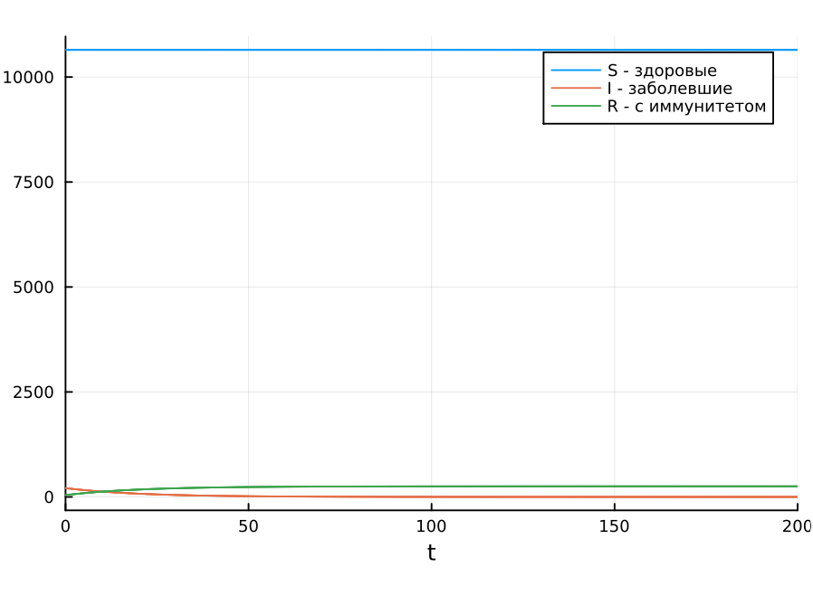
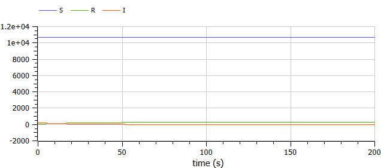
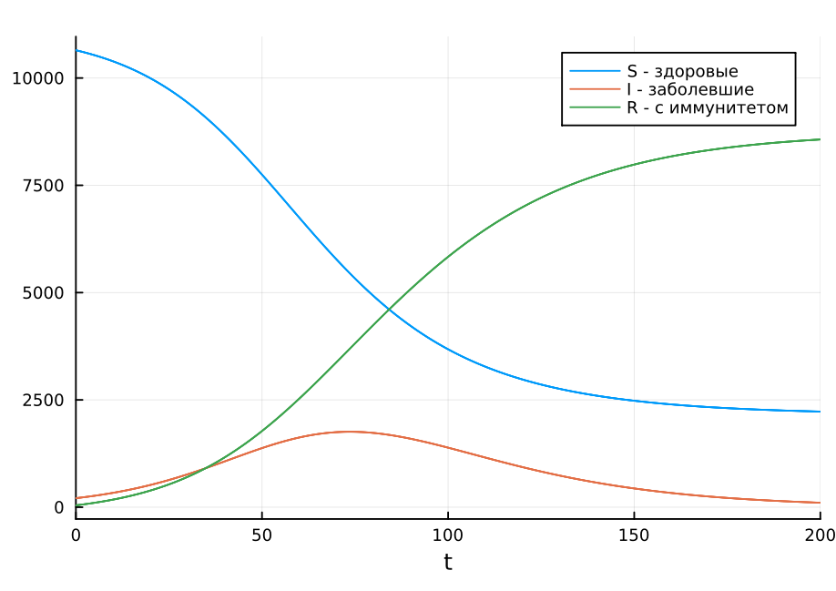
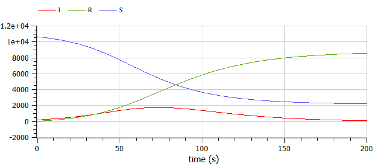

---
## Front matter
lang: ru-RU
title: Презентация по лабораторной работе №6
subtitle: ""
author:
  - Амуничников Антон
institute:
  - Российский университет дружбы народов, Москва, Россия

## i18n babel
babel-lang: russian
babel-otherlangs: english

## Formatting pdf
toc: false
toc-title: Содержание
slide_level: 2
aspectratio: 169
section-titles: true
theme: metropolis
header-includes:
 - \metroset{progressbar=frametitle,sectionpage=progressbar,numbering=fraction}
 - '\makeatletter'
 - '\makeatother'
---


## Докладчик

  * Амуничников Антон Игоревич
  * 1132227133
  * уч. группа: НПИбд-01-22
  * Факультет физико-математических и естественных наук
  * Российский университет дружбы народов

## Цели и задачи

Исследовать модель SIR (задача об эпидемии).

## Определение варианта

{#fig:1 width=70%}


# Случай $I(0) \leq I^*$

## Выполнение лабораторной работы

```julia
using DifferentialEquations, Plots
function SIR(u, p, t)
         (S, I, R) = u
         (b, c) = p
          N = S + I + R
          dS = 0
          dI = -c*I
          dR = c*I
          return [dS, dI, dR]
end
```

## Выполнение лабораторной работы

```julia
N = 10900
I_0 = 210
R_0 = 43
S_0 = N - I_0 - R_0
u0 = [S_0, I_0, R_0]
p = [0.1, 0.05]
tspan = (0.0, 200.0)
```

## Выполнение лабораторной работы

```julia
prob1 = ODEProblem(SIR, u0, tspan, p)
sol1 = solve(prob1, saveat=0.1)
plot(sol1, label=["S - здоровые" "I - заболевшие" "R - с иммунитетом"])
```

## Выполнение лабораторной работы

{#fig:2 width=70%}


## Выполнение лабораторной работы

```
model lab6_1
  parameter Real I_0 = 210;
  parameter Real R_0 = 43;
  parameter Real S_0 = 10647;
  parameter Real N = 10900;
  parameter Real b = 0.1;
  parameter Real c = 0.05;
  Real S(start=S_0);
  Real I(start=I_0);
  Real R(start=R_0);
equation
  der(S) = 0;
  der(I) = -c*I;
  der(R) = c*I;
end lab6_1;
```

## Выполнение лабораторной работы

{#fig:3 width=70%}

# Случай $I(0) > I^*$

## Выполнение лабораторной работы


```julia
function SIR2(u, p, t)
       (S, I, R) = u
       (b, c) = p
       N = S + I + R
       dS = -(b*S*I)/N
       dI = (b*I*S)/N - c*I
       dR = c*I
       return [dS, dI, dR]
end
```

## Выполнение лабораторной работы

```
prob2 = ODEProblem(SIR2, u0, tspan, p)
sol2 = solve(prob2, saveat=0.1)
plot(sol2, label=["S - здоровые" "I - заболевшие" "R - с иммунитетом"])
```

## Выполнение лабораторной работы

{#fig:4 width=70%}

## Выполнение лабораторной работы

```
model lab6_2
  parameter Real I_0 = 210;
  parameter Real R_0 = 43;
  parameter Real S_0 = 10647;
  parameter Real N = 10900;
  parameter Real b = 0.1;
  parameter Real c = 0.05;
  Real S(start=S_0);
  Real I(start=I_0);
  Real R(start=R_0);
equation
  der(S) = -(b*S*I)/N;
  der(I) = (b*I*S)/N - c*I;
  der(R) = c*I;
end lab6_2;
```

## Выполнение лабораторной работы

{#fig:5 width=70%}

## Выводы

В результате выполнения работы была исследована модель SIR (модель эпидемии).


