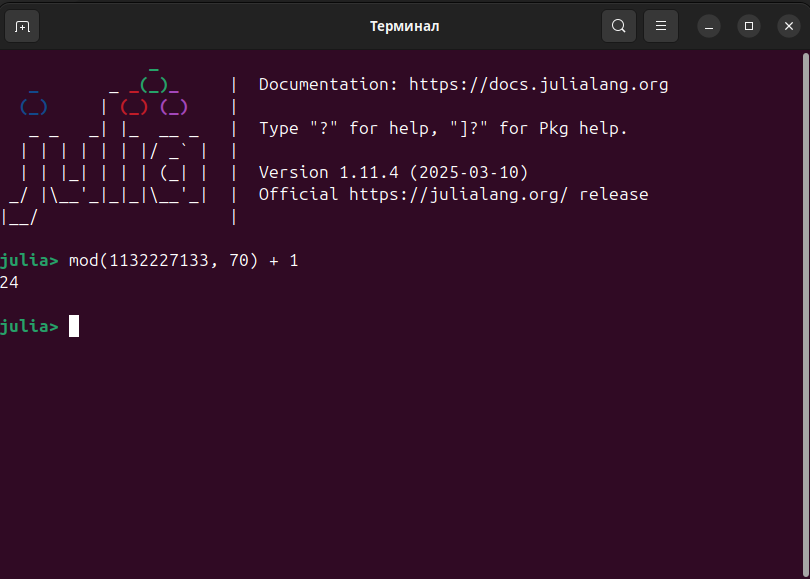
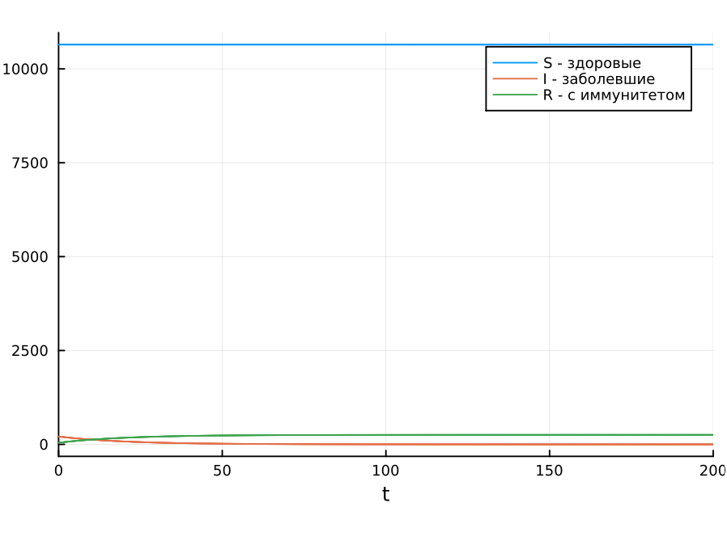
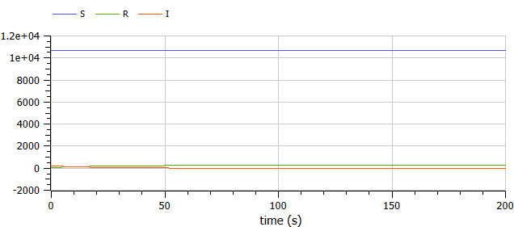
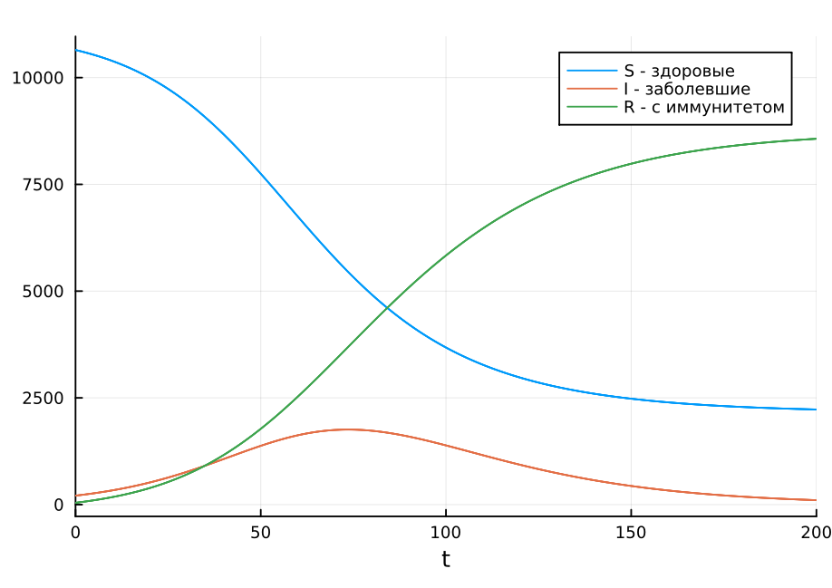
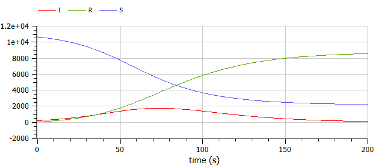

---
## Front matter
title: "Отчет по лабораторной работе № 6"
subtitle: "Математическое моделирование"
author: "Амуничников Антон, НПИбд-01-22"

## Generic otions
lang: ru-RU
toc-title: "Содержание"

## Bibliography
bibliography: bib/cite.bib
csl: pandoc/csl/gost-r-7-0-5-2008-numeric.csl

## Pdf output format
toc: true # Table of contents
toc-depth: 2
lof: true # List of figures
lot: false # List of tables
fontsize: 12pt
linestretch: 1.5
papersize: a4
documentclass: scrreprt
## I18n polyglossia
polyglossia-lang:
  name: russian
  options:
	- spelling=modern
	- babelshorthands=true
polyglossia-otherlangs:
  name: english
## I18n babel
babel-lang: russian
babel-otherlangs: english
## Fonts
mainfont: IBM Plex Serif
romanfont: IBM Plex Serif
sansfont: IBM Plex Sans
monofont: IBM Plex Mono
mathfont: STIX Two Math
mainfontoptions: Ligatures=Common,Ligatures=TeX,Scale=0.94
romanfontoptions: Ligatures=Common,Ligatures=TeX,Scale=0.94
sansfontoptions: Ligatures=Common,Ligatures=TeX,Scale=MatchLowercase,Scale=0.94
monofontoptions: Scale=MatchLowercase,Scale=0.94,FakeStretch=0.9
mathfontoptions:
## Biblatex
biblatex: true
biblio-style: "gost-numeric"
biblatexoptions:
  - parentracker=true
  - backend=biber
  - hyperref=auto
  - language=auto
  - autolang=other*
  - citestyle=gost-numeric
## Pandoc-crossref LaTeX customization
figureTitle: "Рис."
tableTitle: "Таблица"
listingTitle: "Листинг"
lofTitle: "Список иллюстраций"
lotTitle: "Список таблиц"
lolTitle: "Листинги"
## Misc options
indent: true
header-includes:
  - \usepackage{indentfirst}
  - \usepackage{float} # keep figures where there are in the text
  - \floatplacement{figure}{H} # keep figures where there are in the text
---

# Цель работы

Исследовать модель SIR (задача об эпидемии)

# Теоретическое введение

Компартментальные модели являются очень общим методом моделирования. Они часто применяются к математическому моделированию инфекционных заболеваний. Население распределяется по отделениям с помощью меток – например, S, I, или R, (Susceptible, Infectious, or Recovered). Люди могут прогресс между отсеками. Порядок расположения меток обычно показывает структуру потоков между компартментами; например, SEIS означает восприимчивый, подверженный воздействию, инфекционный, затем снова восприимчивый[@wiki_sir].

Зарождение таких моделей относится к началу 20 века, важными работами которого являются работы Росса в 1916 году Росс и Хадсон в 1917 году, Кермак и Маккендрик в 1927 г., и Кендалл в 1956 году. Модель Рид–Мороз также был важным и широко упускаемым из виду предком современных подходов к эпидемиологическому моделированию.

Модели чаще всего управляются с помощью обыкновенных дифференциальных уравнений (которые являются детерминированными), но также могут использоваться со стохастической (случайной) структурой, которая более реалистична, но гораздо сложнее в анализе.

Модели пытаются предсказать такие вещи, как распространение болезни, или общее число инфицированных, или продолжительность эпидемии, а также оценить различные эпидемиологические параметры, такие как репродуктивное число. Такие модели могут показать, насколько различаются вмешательства общественного здравоохранения могут повлиять на исход эпидемии, например, на то, какой метод является наиболее эффективным для выпуска ограниченного количества вакцин в данной популяции.
 
# Задание

## Определение варианта

Использую формулу для определения варианта задания (рис. [-@fig:1]).

{#fig:1 width=70%}

## Задание

На одном острове вспыхнула эпидемия. Известно, что из всех проживающих
на острове ($N=10900$) в момент начала эпидемии ($t=0$) число заболевших людей
(являющихся распространителями инфекции) $I(0)=210$, А число здоровых людей с
иммунитетом к болезни $R(0)=43$. Таким образом, число людей восприимчивых к
болезни, но пока здоровых, в начальный момент времени $S(0)=N-I(0)- R(0)$.

Постройте графики изменения числа особей в каждой из трех групп.

Рассмотрите, как будет протекать эпидемия в случае:

1) если $I(0)\leq I^*$;

2) если $I(0) > I^*$.

# Выполнение лабораторной работы

## Случай $I(0) \leq I^*$

Рассмотрим случай, когда число заболевших не првышает критического значения $I^*$. В данном случае считается, что все больные изолированы и заражения здоровых не происходит.

### Julia

Подключим библиотеки. Зададим функцию для создания системы ДУ нашего случая:

```julia
using DifferentialEquations, Plots

function SIR(u, p, t)
         (S, I, R) = u
         (b, c) = p
          N = S + I + R
          dS = 0
          dI = -c*I
          dR = c*I
          return [dS, dI, dR]
end
```

Зададим начальные условия в соответствии с вариантом, а также коэффициенты заболеваемости и выздоровления:

```julia
N = 10900
I_0 = 210
R_0 = 43
S_0 = N - I_0 - R_0
u0 = [S_0, I_0, R_0]
p = [0.1, 0.05]
tspan = (0.0, 200.0)
```

Решим систему ДУ и построим график решения:

```julia
prob1 = ODEProblem(SIR, u0, tspan, p)
sol1 = solve(prob1, saveat=0.1)
plot(sol1, label=["S - здоровые" "I - заболевшие" "R - с иммунитетом"])
```
Рассмотрим график. Видно, что численность здоровых людей (S) не меняется, поскольку мы рассматриваем случай, когда все больные изолированы, то есть здоровые не заражаются. Число больных уменьшается, а число людей с иммунитетом увеличивается (рис. [-@fig:2]).

{#fig:2 width=70%}

### OpenModelica

Здесь мы задаем параметры, начальные условия, систему ДУ и выполняем симуляцию на том же интервале и с тем же шагом, что и в Julia.

```
model lab6_1
  parameter Real I_0 = 210;
  parameter Real R_0 = 43;
  parameter Real S_0 = 10647;
  parameter Real N = 10900;
  parameter Real b = 0.1;
  parameter Real c = 0.05;
  
  Real S(start=S_0);
  Real I(start=I_0);
  Real R(start=R_0);
  
equation
  der(S) = 0;
  der(I) = -c*I;
  der(R) = c*I;

end lab6_1;
```

Рассмотрим график. Видно, что численность здоровых людей (S) не меняется, поскольку мы рассматриваем случай, когда все больные изолированы, то есть здоровые не заражаются. Число больных уменьшается, а число людей с иммунитетом увеличивается (рис. [-@fig:3]).

{#fig:3 width=70%}


## Случай $I(0) > I^*$

Рассмотрим случай, когда число заболевших превышает критическое значение $I^*$. В данном случае заболевшие особи способны заразить здоровых.

### Julia

Построим новую функцию, где будем учитывать число изменения особей в группах в соответствии со случаем. Начальные условия оставим те же.

```julia
function SIR2(u, p, t)
       (S, I, R) = u
       (b, c) = p
       N = S + I + R
       dS = -(b*S*I)/N
       dI = (b*I*S)/N - c*I
       dR = c*I
       return [dS, dI, dR]
end
```

Решим систему ДУ и построим график решения:

```
prob2 = ODEProblem(SIR2, u0, tspan, p)
sol2 = solve(prob2, saveat=0.1)
plot(sol2, label=["S - здоровые" "I - заболевшие" "R - с иммунитетом"])
```

Рассмотрим график.  Видно, что численность здоровых людей (S) уменьшается, поскольку мы рассматриваем случай, когда больные заражают здоровых. Число больных людей сначала увеличивается, а затем уменьшается, поскольку люди успевают выздоравливать и приобретать иммунитет (это зависит от заданных коэффициентов заболеваемости и выздоровления). В итоге большая часть популяции приобретает иммунитет и становится устойчивой к болезни (рис. [-@fig:4]).

{#fig:4 width=70%}

### OpenModelica

Здесь мы задаем параметры, начальные условия, систему ДУ и выполняем симуляцию на том же интервале и с тем же шагом, что и в Julia.

```
model lab6_2
  parameter Real I_0 = 210;
  parameter Real R_0 = 43;
  parameter Real S_0 = 10647;
  parameter Real N = 10900;
  parameter Real b = 0.1;
  parameter Real c = 0.05;
  
  Real S(start=S_0);
  Real I(start=I_0);
  Real R(start=R_0);
  
equation
  der(S) = -(b*S*I)/N;
  der(I) = (b*I*S)/N - c*I;
  der(R) = c*I;

end lab6_2;
```
Рассмотрим график. Так же, как и на предыдущем, число здоровых особей уменьшается, число заболевших сначала увеличивается, потом уменьшается. Со временем большая часть популяции приобретает иммунитет (рис. [-@fig:5]).

{#fig:5 width=70%}


# Выводы

В результате выполнения работы была исследована модель SIR (модель эпидемии).

# Список литературы{.unnumbered}

::: {#refs}
:::
