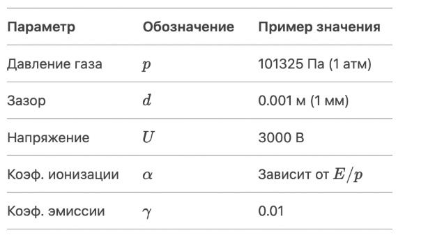
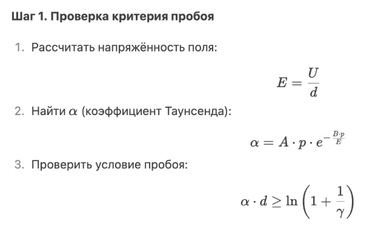
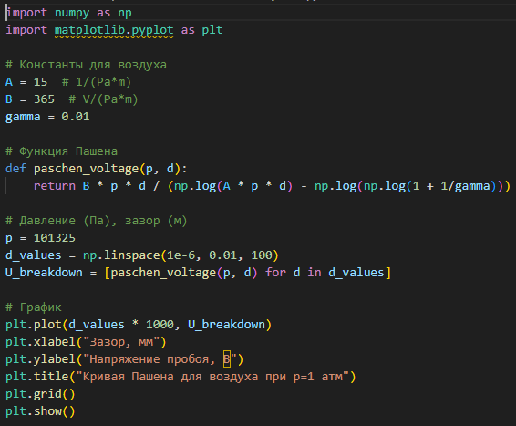
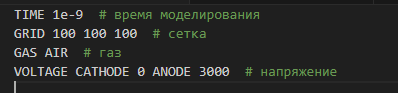

---
## Front matter
lang: ru-RU
title: Электрический пробой
subtitle: Этап №2
author:
  - Дымченко Д.Ю.
institute:
  - Российский университет дружбы народов, Москва, Россия
date: 11 Апреля 2025

## i18n babel
babel-lang: russian
babel-otherlangs: english

## Formatting pdf
toc: false
toc-title: Содержание
slide_level: 2
aspectratio: 169
section-titles: true
theme: metropolis
header-includes:
 - \metroset{progressbar=frametitle,sectionpage=progressbar,numbering=fraction}
 - '\makeatletter'
 - '\makeatother'
---

---

## Докладчики

  * Амуничников Антон Игоревич
  * Леснухин Даниил Дмитриевич
  * Майзингер Эллина Сергеевна
  * Дымченко Дмитрий Юрьевич
  * Матюхин Павел Андреевич
  * Понамарев Алексей Михайлович

## Содержание

1. Введение
2. Выбор подхода к моделированию 
3. Алгоритм моделирования пробоя
4. Инструменты и коды  
5. Дополнительные исследования
6. Выводы  
7. Список литературы  

---

##  Введение

### Актуальность

Надёжная оценка распределения электрического поля и критических условий пробоя является ключевым аспектом при проектировании изоляционных систем, выборе материалов, а также обеспечении электробезопасности и надёжности устройств. 

Также важным фактором является переход от эмпирических моделей (например, кривой Пашена) к более универсальным физически обоснованным методам, которые позволяют учитывать пространственную неоднородность, временную динамику и взаимодействие с материалами.

##  Введение

### Объект и предмет исследования

- Процесс электрического пробоя в диэлектрической среде при наличии неоднородного электрического поля.
- Методы численного моделирования электрического поля и условий пробоя в системах с различной геометрией электродов и граничными условиями.

##  Введение

### Цель работы

Анализ численных методов моделирования электрического пробоя в неоднородных электрических полях.

### Задачи

1. Рассмотреть основные способы моделирования пробоя
2. Составить математическую модель для расчёта электрического поля.
3. Настроить численное моделирование с помощью разных алгоритмов.

---

## Выбор подхода к моделированию

Электрический пробой можно описывать разными методами в зависимости от:

- **Среды** (газ, жидкость, твёрдый диэлектрик),  
- **Точности** (простая аналитическая модель или сложное численное моделирование),
- **Цели** (расчёт пробивного напряжения, визуализация процесса, исследование динамики).

### Аналитические модели

**Подходят**, если нужно быстро оценить параметры пробоя без детального рассмотрения физики.

## Выбор подхода к моделированию

### Закон Пашена

Применяется для **газовых разрядов** (например, искровой пробой в воздухе).

**Когда можно использовать?**

-	Для оценки пробивного напряжения в однородном поле.
-  Если не нужна детальная динамика процесса.

## Выбор подхода к моделированию

Формула Пашена:

$$
U_{\text{пробоя}} = \frac{B \cdot p \cdot d}{\ln(A \cdot p \cdot d) - \ln(\ln(1 + 1/\gamma))}
$$

Где:  
- \( p \) – давление газа,  
- \( d \) – расстояние между электродами,  
- \( A, B \) – эмпирические коэффициенты,  
- \( $\gamma$ \) – коэффициент вторичной эмиссии.

## Выбор подхода к моделированию

#### Метод конечных элементов (FEM)
**Для чего необходим?**

- Расчёт распределения электрического поля $\vec{E} = -\nabla \phi$.
- Учёт сложной геометрии электродов.

## Выбор подхода к моделированию

**Шаги**:

1. Решить уравнение Пуассона:

   $$
   \nabla^2 \phi = -\frac{\rho}{\varepsilon_0}
   $$

2. Добавить условия на границах (например, $\phi = U$ на катоде, $\phi = 0$ на аноде).

3. Найти $\vec{E}$ и проверить, где $|\vec{E}|$ превышает критическое значение $E_{\text{крит}}$.

**Инструменты**: COMSOL, ANSYS, FEniCS (Python)

## Выбор подхода к моделированию

### Particle-in-Cell (PIC)

**Для чего?**

-	Моделирование движения заряженных частиц (электронов, ионов) в самосогласованном поле.

**Алгоритм:**

1. Разбить область на сетку.

2.	На каждом шаге:
   - Рассчитать поле на сетке.
   - 	Переместить частицы в этом поле.
   -	Учесть столкновения и ионизацию.

**Инструменты**: KARAT, COMSOL Plasma Module, VPIC.

## Алгоритм моделирования пробоя

Рассмотрим **газовый пробой** (например, в воздухе) с использованием **уравнения Таунсенда**.

{#fig:001 width=40%}

## Алгоритм моделирования пробоя

{#fig:002 width=50%}

## Инструменты и коды

**Библиотеки**

-	numpy, scipy — расчёты,
-	matplotlib — графика,
-	PyBoltz — моделирование пробоя в газах.

## Инструменты и коды

{#fig:003 width=50%}

## Инструменты и коды

### COMSOL/ANSYS (для FEM)

1.	Создать геометрию электродов.
2.	Задать параметры газа.
3.	Добавить модуль **Electrostatics** или **Plasma**.

## Инструменты и коды

###                KARAT (для PIC-моделирования)

{#fig:004 width=70%}

## Дополнительные исследования

Если необходимо углубиться, требуется исследовать:

-	**Влияние влажности на пробой** (увеличивает $U_{\text{пробоя}}$).
-	**Неоднородные поля** (игла-плоскость).
-	**Динамика стримеров** (нужны PIC-коды).

## Выводы

В ходе работы были рассмотрены основные алгоритмы математического моделирования электрического пробоя с использованием как численных методов, так и языков программирования и прочих инструментов.

## 6. Список литературы

1. Пашен Ф. "Электрические разряды в газах", Москва, 1985.
2. Fridman A., Kennedy L. "Plasma Physics and Engineering", CRC Press, 2011.
3. Кумпан В.О. "Диэлектрики и их применение", СПб, 2002.
"""
