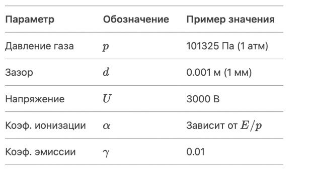
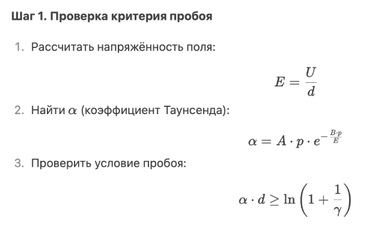
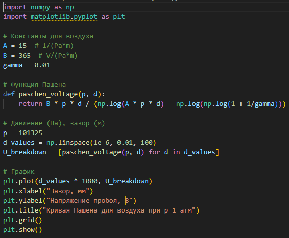
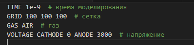

---
## Front matter
title: "Этап 2"
subtitle: "Электрический пробой"
author: 

  - Дымченко Д.Ю.

## Generic otions
lang: ru-RU
toc-title: "Содержание"

## Bibliography
bibliography: bib/cite.bib
csl: pandoc/csl/gost-r-7-0-5-2008-numeric.csl

## Pdf output format
toc: true # Table of contents
toc-depth: 2
lof: true # List of figures
lot: true # List of tables
fontsize: 12pt
linestretch: 1.5
papersize: a4
documentclass: scrreprt
## I18n polyglossia
polyglossia-lang:
  name: russian
  options:
	- spelling=modern
	- babelshorthands=true
polyglossia-otherlangs:
  name: english
## I18n babel
babel-lang: russian
babel-otherlangs: english
## Fonts
mainfont: PT Serif
romanfont: PT Serif
sansfont: PT Sans
monofont: PT Mono
mainfontoptions: Ligatures=TeX
romanfontoptions: Ligatures=TeX
sansfontoptions: Ligatures=TeX,Scale=MatchLowercase
monofontoptions: Scale=MatchLowercase,Scale=0.9
## Biblatex
biblatex: true
biblio-style: "gost-numeric"
biblatexoptions:
  - parentracker=true
  - backend=biber
  - hyperref=auto
  - language=auto
  - autolang=other*
  - citestyle=gost-numeric
## Pandoc-crossref LaTeX customization
figureTitle: "Рис."
tableTitle: "Таблица"
listingTitle: "Листинг"
lofTitle: "Список иллюстраций"
lotTitle: "Список таблиц"
lolTitle: "Листинги"
## Misc options
indent: true
header-includes:
  - \usepackage{indentfirst}
  - \usepackage{float} # keep figures where there are in the text
  - \floatplacement{figure}{H} # keep figures where there are in the text
---

# Этап 2

## Докладчики

  * Амуничников Антон Игоревич
  * Леснухин Даниил Дмитриевич
  * Майзингер Эллина Сергеевна
  * Дымченко Дмитрий Юрьевич
  * Матюхин Павел Андреевич
  * Понамарев Алексей Михайлович
  
---

## Содержание

1. Введение
2. Выбор подхода к моделированию 
3. Алгоритм моделирования пробоя
4. Инструменты и коды
5. Дополнительные исследования
6. Выводы
7. Список литературы  

---

## 1. Введение

### Актуальность

Надёжная оценка распределения электрического поля и критических условий пробоя является ключевым аспектом при проектировании изоляционных систем, выборе материалов, а также обеспечении электробезопасности и надёжности устройств. Особую актуальность данное направление приобретает в приложениях, где присутствует сложная геометрия электродов или неоднородные диэлектрические среды. В таких случаях аналитические методы оказываются недостаточными, и требуется использование численного моделирования — в частности, методов конечных элементов (FEM) и других подходов, способных точно воспроизводить реальные условия. Кроме того, развитие концепции «цифрового двойника» в инженерных задачах требует высокой точности и воспроизводимости моделей электрического пробоя.

Также важным фактором является переход от эмпирических моделей (например, кривой Пашена) к более универсальным физически обоснованным методам, которые позволяют учитывать пространственную неоднородность, временную динамику и взаимодействие с материалами.

### Объект и предмет исследования

- Процесс электрического пробоя в диэлектрической среде при наличии неоднородного электрического поля.
- Методы численного моделирования электрического поля и условий пробоя в системах с различной геометрией электродов и граничными условиями.

### Цель работы

Целью настоящего исследования является и анализ численных методов моделирования электрического пробоя в неоднородных электрических полях с учётом геометрии электродов, граничных условий и критических параметров среды.

### Задачи

1. Рассмотреть основные способы моделирования пробоя
2. Составить математическую модель для расчёта электрического поля.
3. Настроить численное моделирование с помощью разных алгоритмов.

---

## 2. Выбор подхода к моделированию

Электрический пробой можно описывать разными методами в зависимости от:

- **Среды** (газ, жидкость, твёрдый диэлектрик),  
- **Точности** (простая аналитическая модель или сложное численное моделирование),
- **Цели** (расчёт пробивного напряжения, визуализация процесса, исследование динамики).

### Аналитические модели

**Подходят**, если нужно быстро оценить параметры пробоя без детального рассмотрения физики.

#### Закон Пашена

Применяется для **газовых разрядов** (например, искровой пробой в воздухе).

Формула Пашена:

$$
U_{\text{пробоя}} = \frac{B \cdot p \cdot d}{\ln(A \cdot p \cdot d) - \ln(\ln(1 + 1/\gamma))}
$$

Где:  
- \( p \) – давление газа,  
- \( d \) – расстояние между электродами,  
- \( A, B \) – эмпирические коэффициенты,  
- \( $\gamma$ \) – коэффициент вторичной эмиссии.  

**Пример для воздуха:**
A ≈ $15~\mathrm{m}^{-1} \cdot \mathrm{Pa}^{-1}$,  
B ≈ $\frac{365~\mathrm{V}}{\mathrm{m} \cdot \mathrm{Pa}}$

**Когда можно использовать?**

-	Для оценки пробивного напряжения в однородном поле.
-  Если не нужна детальная динамика процесса.

### Численные методы

**Нужны**, если требуется смоделировать **распределение поля, зарождение стримеров, неоднородные поля**.

#### Метод конечных элементов (FEM)
**Для чего необходим?**

- Расчёт распределения электрического поля $\vec{E} = -\nabla \phi$.
- Учёт сложной геометрии электродов.

**Шаги**:

1. Решить уравнение Пуассона:

   $$
   \nabla^2 \phi = -\frac{\rho}{\varepsilon_0}
   $$

2. Добавить условия на границах (например, $\phi = U$ на катоде, $\phi = 0$ на аноде).

3. Найти $\vec{E}$ и проверить, где $|\vec{E}|$ превышает критическое значение $E_{\text{крит}}$.

**Инструменты**: COMSOL, ANSYS, FEniCS (Python)

### Particle-in-Cell (PIC)

**Для чего?**

-	Моделирование движения заряженных частиц (электронов, ионов) в самосогласованном поле.

**Алгоритм:**

1. Разбить область на сетку.

2.	На каждом шаге:
   - Рассчитать поле на сетке.
   - 	Переместить частицы в этом поле.
   -	Учесть столкновения и ионизацию.

**Инструменты**: KARAT, COMSOL Plasma Module, VPIC.
---

## 3. Алгоритм моделирования пробоя

Рассмотрим **газовый пробой** (например, в воздухе) с использованием **уравнения Таунсенда**.

### Входные параметры (рис. [-@fig:001]).

{#fig:001 width=70%}

### Пошаговый алгоритм (рис. [-@fig:002]).

{#fig:002 width=70%}

**Шаг 2. Численное моделирование (если нужно)**

Если поле неоднородное, используем **FEM**:

1. Задать геометрию (например, игла–плоскость).
2. Решить уравнение Пуассона.
3. Найти области, где $E > E_{\text{крит}}$.

**Шаг 3. Визуализация**

- График $U_{\text{проб}}(d)/U_{\text{порог}}(d)$ (кривая Пашена).
- Распределение $\vec{E}$ в COMSOL / Matplotlib.

---

## 4. Инструменты и коды

### Python (для аналитики и простых моделей)

**Библиотеки**

-	numpy, scipy — расчёты,
-	matplotlib — графика,
-	PyBoltz — моделирование пробоя в газах.

**Пример кода для кривой Пашена:** (рис. [-@fig:003]).

{#fig:003 width=70%}

### COMSOL/ANSYS (для FEM)

1.	Создать геометрию электродов.
2.	Задать параметры газа.
3.	Добавить модуль **Electrostatics** или **Plasma**.

### KARAT (для PIC-моделирования)

Пример входного файла: (рис. [-@fig:004]).

{#fig:004 width=70%}

---

## 5. Дополнительные исследования

Если необходимо углубиться, требуется исследовать:

-	**Влияние влажности на пробой** (увеличивает $U_{\text{пробоя}}$).
-	**Неоднородные поля** (игла-плоскость).
-	**Динамика стримеров** (нужны PIC-коды).

---

## 6. Выводы

В ходе работы были рассмотрены основные алгоритмы математического моделирования электрического пробоя с использованием как численных методов, так и языков программирования и прочих инструментов.

---

## 7. Список литературы

1. Пашен Ф. "Электрические разряды в газах", Москва, 1985.  
2. Fridman A., Kennedy L. "Plasma Physics and Engineering", CRC Press, 2011.  
3. Кумпан В.О. "Диэлектрики и их применение", СПб, 2002.  

